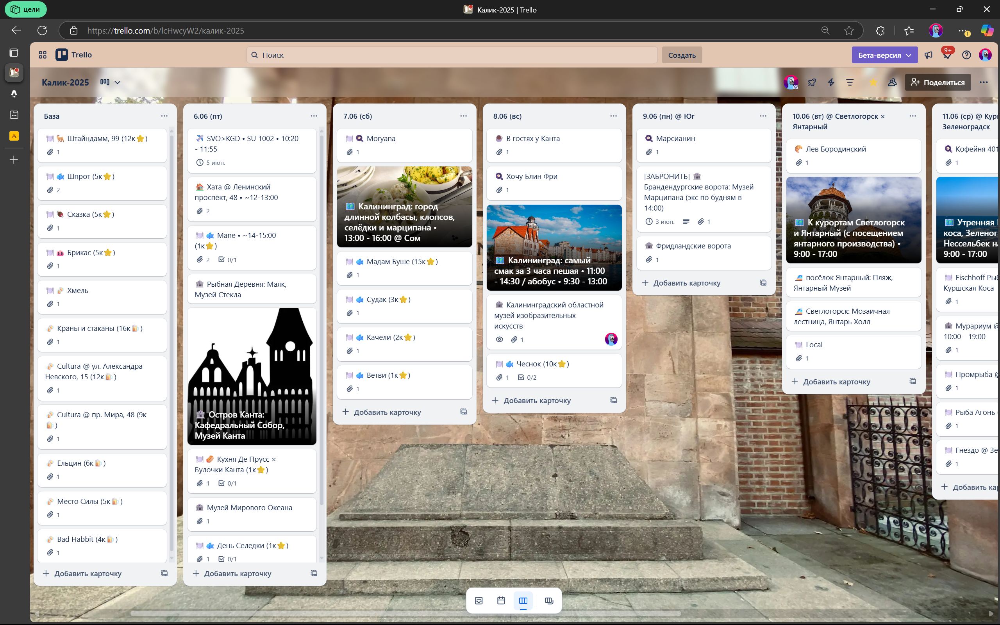

---
layout: ../../layouts/Layout.astro
---

# Тревел Гайд 

## Бюджет

<code>10к ₽ × чел. × день</code>

_**Пример:** `10к ₽ × 2 чела × 8 дней = 160к ₽`_

## Экскурсии 

- **Индивидуалки** - хороши, но только за большие бабки (`7к+ ₽ / 2 чел.`)
- **Групповые** - 50 челов в автобусе - уже звучит хуёво • хотя дешево (`1-2к ₽ / чел.`) • и в ебеня можно добраться ровно

## Планирование 

- Расписывать план на **каждый день + иметь базу** вариантиков, если что-то пойдет не по плану
- Расписывать удобно в Trello/Notion -- в виде доски:

### Бронирование 

- **Для движух**: обязательно, за пару недель
- **Для рестиков**: можно на месте, можно на лакичах

## Гуляние

- **Использовать карту всегда**, когда есть цель маршрута
- Если надо куда-то определенно сходить, но ты уже проходил место, то все равно надо использовать карту, **память не в помощь**

## Рестики

### Куча рестов с 5⭐ -- как выбрать?

- **Читать меню + смотреть картинки** либо **на интуитничах**