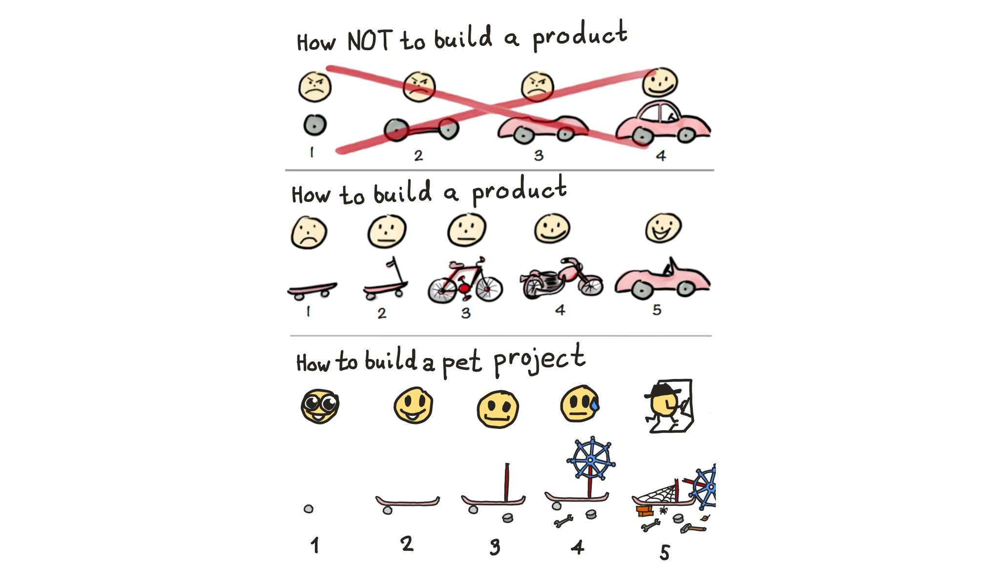

# Прототипирование

- Если хочется сделать приложение для решения проблемы, то для начала стоит **погуглить готовые решения**
- Иначе, вместо решения изначальной проблемы, ты будешь занят решением другой проблемы - написанием приложения
- Если все говно, то пробуем сделать свой продукт на базе **экселя** или **Notion**/[Airtable](https://www.airtable.com)
  /другой nocode
- Если и ноукод бессилен, то начинаем делать **MVP**

---

## На чем делать MVP?

- На чем ты умеешь
- На чем-то максимально простом

## Простой фронтенд

- **Тг бот** - хороший фронтенд, если достаточно текста
    - Хотя там уже столько всего накрутили, что туда можно полоценные веб приложения деплоить
- **HTML-файл** - все можно сделать в рамках одного файла, без всяких npm-пакетов, сборщиков, фреймворков (почти)

---

<b>СДЕЛАЙ ТЫ УЖЕ ХОТЬ ЧТО-НИБУДЬ</b>

---

### А как?

- **А как динамику добавить?** Есть [petite Vue](https://github.com/vuejs/petite-vue) - урезанный 6кб вью, который
  ставится
  по ссылке
- **А как дезигн сделать?** Юзай лайтовые ксс фейерверки:
    - [bulma](https://bulma.io/) - лайтовый css-фреймворк как есть - просто импортишь css-файл, и дальше используешь
      классы/компоненты
    - [tacit](https://yegor256.github.io/tacit/) - еще проще - импортишь либу и вообще не надо писать классы, все уже и
      так выглядит норм
    - [tailwind](https://tailwindcss.com/) - если хочется кастомный диз, но писать css-код не хочется - этот фреймворк
      предоставляет утилитки на все случаи жизни
    - [Больше css-фреймворков](https://github.com/troxler/awesome-css-frameworks)
- **А как хоститься?** Github Pages или закинуть статику
  на [Yandex Object Storage](https://cloud.yandex.ru/services/storage)

## А как бекенд сделать?

- Юзать **BAAS**: [фаербейз](https://firebase.google.com/) и [другие](https://www.youtube.com/watch?v=SXmYUalHyYk)
- Использовать **serverless** функции - напр. [Cloud Function](https://cloud.yandex.ru/services/functions) от Яндекс
  облака
    - Писать код бека можно прямо в интерфейсе
- **А че по базам?** Яндекс предоставляет [ydb](https://cloud.yandex.ru/services/ydb) - бд на serverless
    - Стоит ничего при петпроджект нагрузке

## Когда переходить к вещам посерьёзнее?

- Когда мвп работает (приносит ценность)
- Когда один файл поддерживать сложно

---

И помни...

<b>НИКАКИХ КУБЕРОВ</b>

