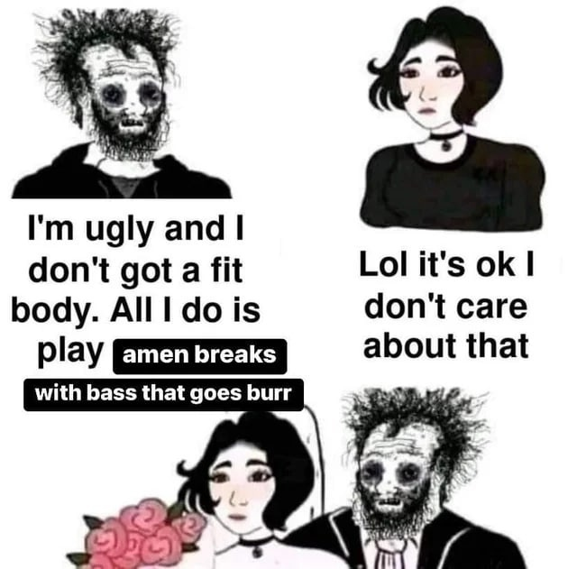

# Музыка

- Я очень люблю музыку, так что она мне надоела
- Тем не менее я хочу о ней написать
- Мой [плейлист с триповыми клипами](https://www.youtube.com/playlist?list=PLdb8DVmvU9i5bGINNz10f-ga_bqD41O4q)
- [Мемная База](https://vk.com/come_to_brazil)

## Техно

- Евро: всякие виталики и гесы
- Рус: локеды
- Немцы: швешельгельб

## Экспериментальный реп

- Грипсы

- Клиппинг
- Jpegmafia aka Пеги
- Кста есть видос про него
  <iframe width="560" height="315" src="https://www.youtube.com/embed/evy5J-1jP1g" title="YouTube video player" frameborder="0" allow="accelerometer; autoplay; clipboard-write; encrypted-media; gyroscope; picture-in-picture" allowfullscreen></iframe>
- Да и вообще прикольны [канальчик про рэпчик](https://www.youtube.com/@MutenRoshi5137) - подписывайтес
- И про грипсов там, одобряю крч
  <iframe width="560" height="315" src="https://www.youtube.com/embed/_oNJmLQpUTw" title="YouTube video player" frameborder="0" allow="accelerometer; autoplay; clipboard-write; encrypted-media; gyroscope; picture-in-picture" allowfullscreen></iframe>

## Грайндкор

- Хороший грайндкор - это бластбиты, шумные гитары (которые звучат как шум воды) и экстрим вокал
- Есть поп грайнд, есть андер
- Поп-грайнд: Nasum, Pig Destroyer

## Эксперимантал электро

- Sophie
- Dorian Electra
- Shygirl
- Quay Dash

## Drum'n'Bass

- Ну че там, база-база - это **Pendulum, Qemists, Concord Dawn, Noisia**

<iframe frameborder="0" style="border:none;width: 100%;height:100px;" height="100" src="https://music.yandex.ru/iframe/#track/39909586/5167263">
Слушайте <a href='https://music.yandex.ru/album/5167263/track/39909586'>Don't Tell Me</a>
— <a href='https://music.yandex.ru/artist/719344'>Concord Dawn</a> на Яндекс Музыке</iframe>

- Сегодня в 2к22 драмчик по-прежнему актуален, и звучит абсолютно так же как и 15 лет назад)))

<iframe frameborder="0" style="border:none;width:100%;height:100px;"  height="100" src="https://music.yandex.ru/iframe/#track/101316939/21350984">Слушайте <a href='https://music.yandex.ru/album/21350984/track/101316939'>Burn 'Em Down</a> — <a href='https://music.yandex.ru/artist/3228992'>Pythius</a> на Яндекс Музыке</iframe>

<iframe frameborder="0" style="border:none;width:100%;height:100px;" height="100" src="https://music.yandex.ru/iframe/#track/52467702/7388929">Слушайте <a href='https://music.yandex.ru/album/7388929/track/52467702'>Push It To The Limit</a> — <a href='https://music.yandex.ru/artist/632210'>Qo</a> на Яндекс Музыке</iframe>

<iframe frameborder="0" style="border:none;width:100%;height:100px;"  height="100" src="https://music.yandex.ru/iframe/#track/50008390/6883838">Слушайте <a href='https://music.yandex.ru/album/6883838/track/50008390'>Jungle Reprezentah</a> — <a href='https://music.yandex.ru/artist/1323029'>Lowriderz</a> на Яндекс Музыке</iframe>

- Хотя есть НОВАТОРСКИЕ ребята, типа ~~Северсталь~~ Sewerslut 

## Базовый хардкорчик

- Xibalba
- Varials

## Мешапы

- Мешапы - это когда 2+ трека миксуют и получается прикольно, даже [музтв про это статью написал](https://muz-tv.ru/news/smeshano-i-smeshno-chto-takoe-meshap-i-pochemu-eto-tak-veselo/)
- [Legaloli](https://vk.com/legaloli) 
- [sektorjazza](https://vk.com/cringerecords) - лиричные мешапы
- [DeepSpaceAudio](https://vk.com/dspaudio) - днб мешапы
- [MOVIESTRAIFE](https://vk.com/moviestraife_group) - мощные мешапы
- [FinalSketch](https://vk.com/finalsketchmusic) - брейккор мешапы
- [Zetton](https://vk.com/zetton_mashups)
- [Качественный Саунд](https://vk.com/highqualitysound) - мультисурс мешапы, тоже днбшные
- [Gefalsht](https://vk.com/gefalsht) - турбомешапы, набирающие [миллионы просмотров](https://www.youtube.com/watch?v=k0H4GwnT5kE)
