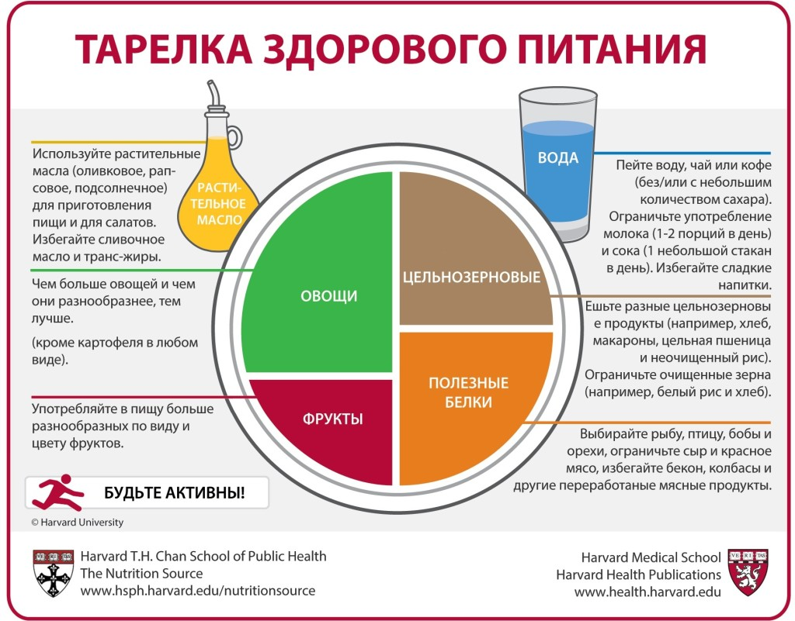

# Еда 🐷

## Как есть?

- Часто (раз в ~3 часа) + маленькими порциями - прочитал это в ["То, как мы работаем, – не работает"](https://www.litres.ru/toni-shvarc/to-kak-my-rabotaem-ne-rabotaet-proverennye-sposoby-upravleniya/chitat-onlayn/)
- Следуя [здоровой тарелке питания](
  https://www.hsph.harvard.edu/nutritionsource/healthy-eating-plate/translations/russian/)

### Здоровая тарелка питания подробнее

**Напитки**

- **Избегать**: Сладкие напитки
- **Ограничить**: Сахар, Молоко, Сок
- **Рекомендуется**: Вода, Чай, Кофе

**Масло**

- **Избегать**: Сливочное, Транс-жиры
- **Рекомендуется:** Оливковое, Рапсовое, Подсолнечное, Кукурузное, Арахисовое, Льняное, Кунжутное

**Овощи**

- **Избегать**: Картоха
- **Рекомендуется:** Капуста, Тыква, Цветная капуста, Броколи, Квашеная капуста, Сладкий перец, Морковь, Помидор,
  Свекла, Кукуруза, Огурцы, Зелень (шпинат, руккола), Кабачки, Лук, Редис, Баклажаны

**Фрукты**

- **Рекомендуется:** Хурма, Виноград, Клубника, Смородина, Яблоко, Малина, Апельсин, Груша, Абрикос, Слива, Голубика,
  Банан, Сухофрукты

**Цельнозерновые**

- **Ограничить:** Белый рис, Белый хлеб, Сладкая выпечка
- **Рекомендуется:** Цельнозерновой хлеб, Цельнозерновые макарошки (такая невкусная тема жесть), Неочищеный рис (ака
  бурый), Крупы (пшеница, ячмень, киноа, овсянка, гречка, булгур, кус-кус, перловка, кукурузная крупа)

**Полезные белки**

- **Избегать:** Бекон, Колбаса, Сосиски, Переработанные мясные продукты
- **Ограничить:** Красное мясо, Сыр
- **Рекомендуется:** Рыба, Морепродукты, Яйца, Птицы, Бобы (фасоль, горох, бобы, чечевица), Орехи, Молочка (типа
  творога)
