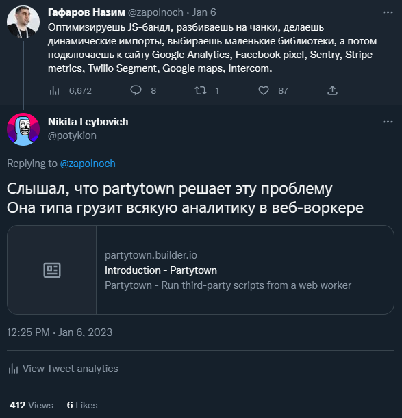
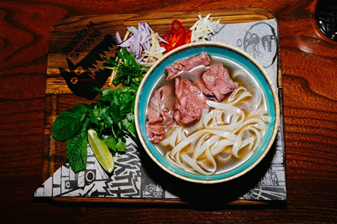
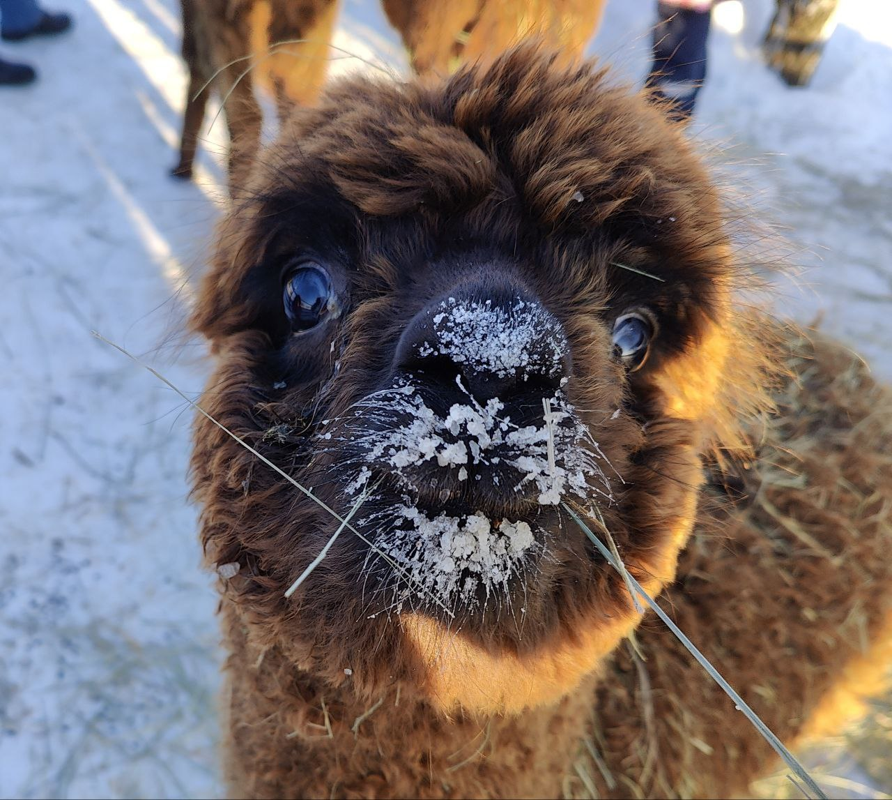
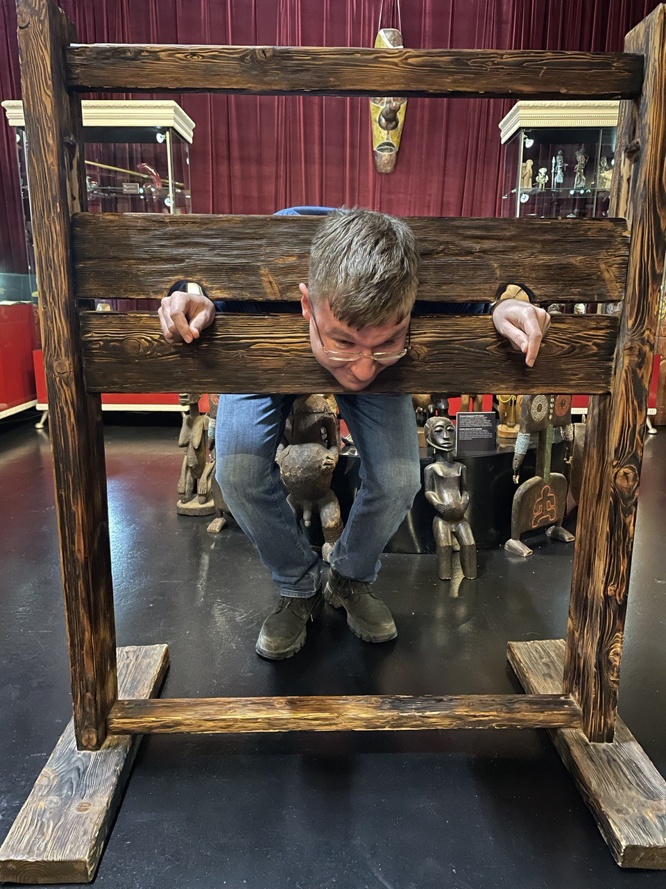
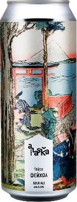
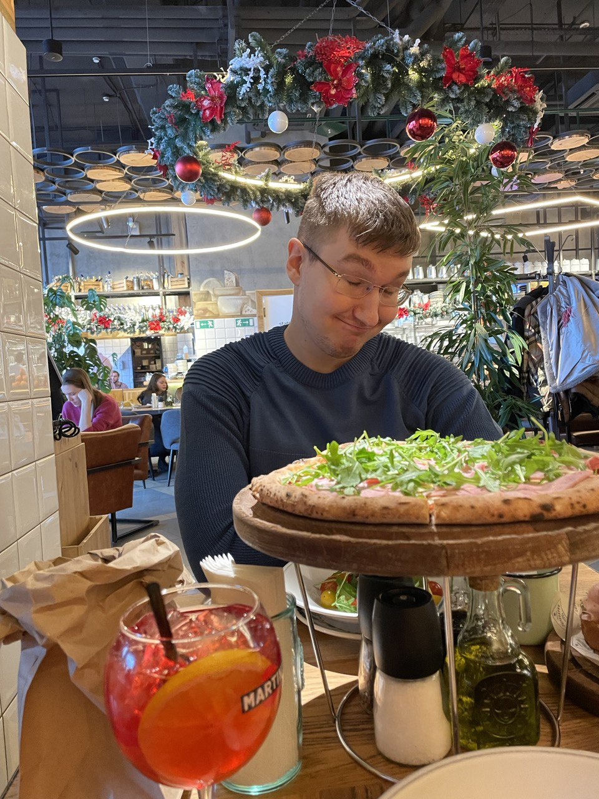
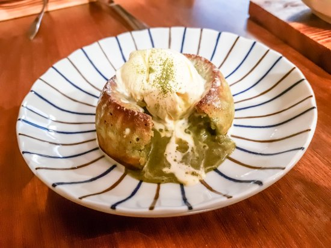
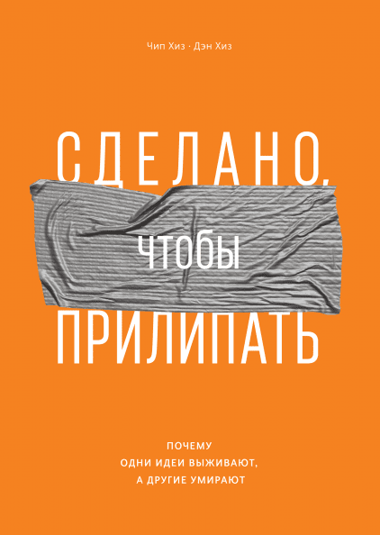

---
hide:
- toc
- navigation
title: Газета 📰 / Выпуск №1 от 2022-01-09
description: Новости моего манямирка
cover: Gazeta/1/cover.png
---

# [Газета 📰](../index.md) / Выпуск №1 от 2022-01-09 {.no-margin}

_Новости моего манямирка_

<a href="https://twitter.com/potykion/status/1611292953389023234/" target="_blank" >
    
    

    😌 Написал полезный твит - <b>приятно быть нужным</b>
    

</a>

 

<a href="https://cssgridgarden.com/" target="_blank" >
    
    

    🔎 Уютненько поливай морковочку и трави сорняки с помощью CSS grid на <b>cssgridgarden</b>
    

</a>

<a href="https://www.kinopoisk.ru/series/4771892/" target="_blank">
    
    
📺 Наркота, стрельба, долбоебизм - пиздюшня страдает хуйней в сериале <b>Черная весна</b>

</a>

  <iframe width="560" height="315" src="https://www.youtube.com/embed/b8haneaeO7s" title="YouTube video player" frameborder="0" allow="accelerometer; autoplay; clipboard-write; encrypted-media; gyroscope; picture-in-picture; web-share" allowfullscreen></iframe></iframe></iframe>
    
📹 Якуты лутают рыбу <b>мешками</b>

<a href="https://volkiyolki.ru/"  target="_blank" style="color: black">

🍔 Гуляя по Арбату, наткнулись на кафешку со всякой дичью - <b>Волки & Ёлки</b> - тут <i>фо с лосем, бургер с кабаном, мясо с папоротником</i>

</a>

<a href="https://www.alpacainfo.ru/" target="_blank">
    
    
🦙 В -26°, потратив косаря 4 на такси, кормили и умилялись <b>Российскими Альпаками</b>

</a>

<a href="https://tochkag.net/"  target="_blank" style="align-self: center;">

🏛 Много деформированных членов и бдсм-девайсов в <b>Музее эротики и секса Точка G</b> - возбуждения ждать не стоит

</a>

<a href="/Code/Python/Base/Subprocess" target="_blank">
    

    
📝 Из 15 аргументов функции <code>subprocess.run</code>, позволяющей запускать программы из Python, по факту нужно 2-3 аргумента

</a>

    <iframe frameborder="0" style="border:none;width:100%;height:180px;" width="100%" height="180" src="https://music.yandex.ru/iframe/#track/37231309/4712222">Слушайте <a href='https://music.yandex.ru/album/4712222/track/37231309'>Девочка с Лиговского</a> — <a href='https://music.yandex.ru/artist/4622996'>Овсянкин</a> на Яндекс Музыке</iframe>
    <a href="https://vk.com/wall-15176531_32485" style="color: white"  target="_blank" class="card-text">
💀 Умер Эпп - важнейший культурообазующий ру-реперок Без него не было бы винишко-тян 
</a>

<a href="/Code/Frontend/Vue/FormKit" target="_blank">
    
    
📝 Скучную рутину с html-формочками решает <b>FormKit</b>

</a>

<a href="https://untappd.com/b/alaska-brewery-fejhoa-feijoa/3860629" target="_blank">

🍺 <b>Alaska Feijoa</b> - топ пивчик с феехуеей

</a>

    
💡 Барахлит менталочка? <b style="font-size: 2em">Прогуляйся</b> 

<a href="https://syrovarnya.com/"  target="_blank" style="color: black">

🧀 Сопливо-нежная <i>буратта</i>, несуразная брускетта со <i>страчателлой</i> и <i>мортаделлой</i>, а также пиццуня с <i>тамбовским окороком</i> - принесли все и сразу в <b>Сыроварня</b>

</a>

<a href="https://cornercafekitchenmsk.com/"  target="_blank">

🍮 Фондан - вкусный, стремно выглядящий и непонятно на что похожий десерт в <b>Corner</b>

</a>

<a href="https://www.mann-ivanov-ferber.ru/books/sdelano-chtobyi-prilipat/"  target="_blank" style="display: flex; flex-direction: column" >

📖 Почему <i>городская легенда про банду похитителей органов - это по определению интересно, а финансовая стратегия некоммерческой организации - по определению неинтересно</i> рассказывается в  <b>Сделано, чтобы прилипать</b>

</a>

