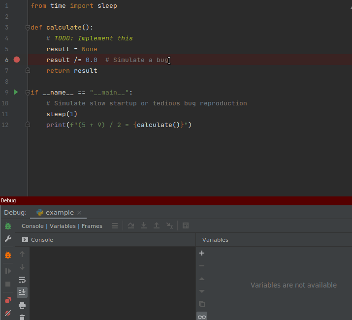

---
hide:
- toc
- navigation
title: Выпуск №2 от 2022-01-16
description: Новости моего манямирка

---

# [Газета 📰](../index.md) / Выпуск №2 от 2022-01-16 {.no-margin}

_Новости моего манямирка_

<a href="../../Code/Python/Tools/reloadium" target="_blank">

📝 <b>reloadium</b> - автоматический перезапуск PyCharm при правке кода во время дебага, не без нюансов

</a>

<a href="https://fuckrkn1.org/#ru" target="_blank">

🔎 <b>FuckRKN1</b> - челы во главе @2pizza делают бесплатный впн

</a>

<iframe width="560" height="315" src="https://www.youtube.com/embed/S7X6fLbdwlc" title="YouTube video player" frameborder="0" allow="accelerometer; autoplay; clipboard-write; encrypted-media; gyroscope; picture-in-picture; web-share" allowfullscreen></iframe>

📹 Как выбрать фронденд фреймворк в 2023 от реакт чела

<a href="https://www.kinopoisk.ru/film/1596/" target="_blank">

🎥 <b>Разбирая Гарри</b> - в свое мире - лучше всего

</a>

<a href="https://excalidraw.com/" target="_blank">

🔎 <b>excalidraw</b> - топ рисовалка диаграмм

</a>

<iframe frameborder="0" style="border:none;width:100%;height:180px;" width="100%" height="180" src="https://music.yandex.ru/iframe/#track/106295920/23151074">Слушайте <a href='https://music.yandex.ru/album/23151074/track/106295920'>Obsessed To Forget</a> — <a href='https://music.yandex.ru/artist/10012723'>benzii</a> на Яндекс Музыке</iframe>

🎵 <b>benzii</b> - тупа лучшая - мощный грустный денс

<a href="https://github.com/bndr/pipreqs">

🔎 <b>pipreqs</b> - идея прикольная: сканит код и выводит зависимости - удобно когда нет requirements.txt, или хочется стройный requirements, без сабзависимостей. Но работает только на Python 3+ - жаль, ~~что ты пидор~~ что я утонул в Python 2 легаси - оч хочу перевести его на Python 3 в этом году, а то столько упускаю 😢😢😢  

</a>

