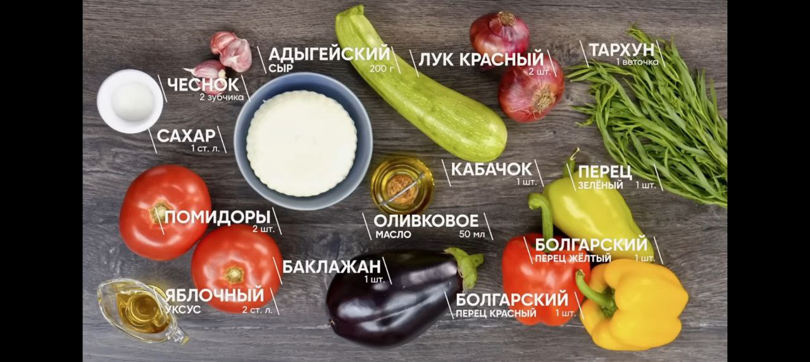

# Рецепты

## Паста 🍝

### Ала норма с баклажанами

**Что надо**

- Макароны
- Баклажан
- Помидоры
- Чеснок
- Базилик
- Перчик
- Сахар
- Брынза / фета

**Как делать**

- https://www.youtube.com/watch?v=VCeHKUWp600
- Режем баклажан, солим, оставляем, чтобы выделился сок
- Режем чеснок, перец, помидоры
- Жарим чеснок, перчик, помидоры, солим, перчим, сахарим
- Блендерим помидорную смесь
- Моем баклажаны, жарим
- Варим макароны
- Закидываем в соус базилик, баклажаны, макароны
- Посыпаем брынзой, базиликом, маслом

### С лососем и сливками

**Что надо**

- Макароны
- Брокколи
- Лосось холодного копчения или слабосоленый
- Лук шалот или репчатый
- Белое вино
- Сливки 22+ жирности
- Сыр

**Как делать**

- https://www.youtube.com/watch?v=tzl-DRCYPv8
- Варим макароны
- Нарезаем брокколи, лук
- Жарим лук, жарим брокколи
- Вливаем вино, выпариваем
- Вливаем сливки
- Соль, перец
- Закидываем лосось
- Закидываем спагетти
- Потереть сыра

## Салаты 🥗

### Аля греческий

**Что надо**

- помидоры
- огурцы
- перец
- оливки
- сыр, типа фетаксы
- уксус по желанию
- Масло

**Как делать**

- Все режем, все смешиваем

### Мангал-салат

**Что надо**

- Перец
- Баклажан
- Кабачок
- Лук
- Помидор
- Чеснок
- Уксус
- Масло
- Сахар
- Тархун
- Сыр адыгейский

**Как делать**

- Вместо мангала можно юзать гриль
- https://www.youtube.com/watch?v=sso0qRN-7Fs
- Перец в гриль, по готовности закидываем в пакет, чтобы шкурка слезла
- Баклажаны и кабачки в гриль, посыпая солью
- Лук в гриль
- Делаем заправку: чеснок + уксус + масло + сахар + тархун
- Помидор нарезаем
- Все соединяем, солим
- Сыр в гриль, затем на салат

## Морепродукты 🍤

### Креветки пиль-пиль

**Что надо**

- Креветки
- масло оливковое много
- чеснок много
- острый перец для пикантности
- хлеб

**Как делать**

- https://youtu.be/l0y82cctgnQ
- масле на маленьком огне обжариваем чеснок и перец
- кидаем туда креветосы
- в отдельной сковороде делаем греночки
- получившееся масло используем как соус

## Мучное 🥪

### Кесадилья утренняя

**Что надо**

- 2 тортильи
- 2 яйца
- Сыр тертый
- Помидор слайсами
- Салями слайсами

**Как делать**

- https://www.youtube.com/watch?v=WuMRoHbvCUM
- Яйца взбиваем и на сковороду
- Посыпаем сыром
- Сверху тортилью, ждем пару секунд и переворачиваем
- Выкладываем помидор и салями
- Еще раз сыр и тортилья, и переворачиваем

## База 🏫

### Рис

- https://eda.ru/recepty/osnovnye-blyuda/rassypchatyy-ris-57517
- В кастрюлю засыпаем рис и воду в соотношении 1:1.5 - на 100г риса 150мл воды
- Доводим до кипения без крышки
- Накрываем крышкой, огонь на минималку, варим 10 минут
- Перемешиваем, оставляем отдыхать на произольное время