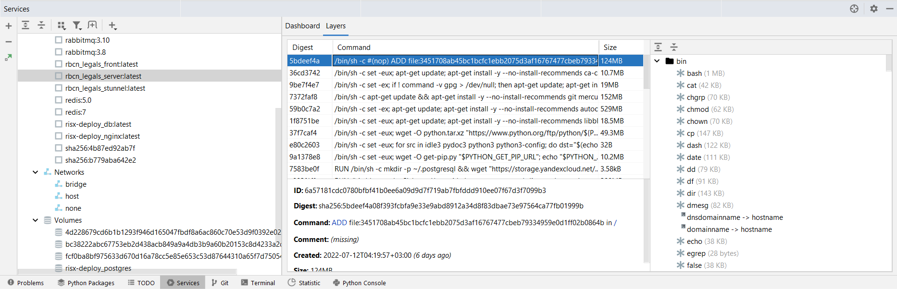
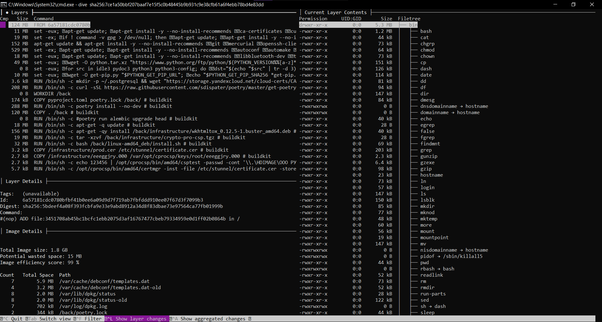

# Оптимизло диска

## Как посмотреть сколько места осталось?

...

## Как соптимайзить докер-образы?

- Анализировать слои с помощью pycharm

- Анализировать слои с помощью dive

- dive и pycharm отображают вложенные слои, так что стоит начать смотреть на слои после команды FROM из dockerfile
- dive и pycharm по функционалу одинаковы, однако в dive есть метрика Image efficiency score - если она 99%, то очевидно
  нечего оптимайзить

- Если нечего оптимайзить, то стоит обратить внимание на базовые имеджи
    - Напр. образ python:3.8 весит почти гиг
    - Существуют slim и alpine версии базовых имеджей, которые весят порой на порядок меньше, но с ними нужно аккуратно,
      тк каких-то зависимостей, которые используются неявно, может не хватать
