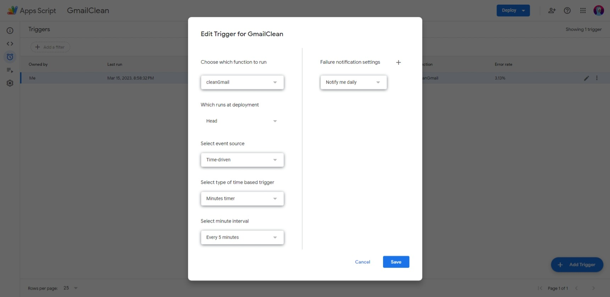

---
 tags:
   - apps-script
---

# Как автоматически почистить GMail почту?

**Юзать [Apps Script](index.md)!** 

1. Пишем скрипт:

    ```javascript
    function cleanGmail() {
      GmailApp.getUserLabelByName("label").getThreads().slice(0, 100).forEach(t => t.moveToTrash());
    }
    ```

2. Запускаем **для авторизации** и дебага

3. **Делаем триггер** - раз в 5 минут будем удалять по 100 тредов (цепочек сообщений с одной темой):
   
    

**Все!**