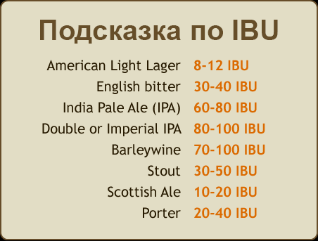
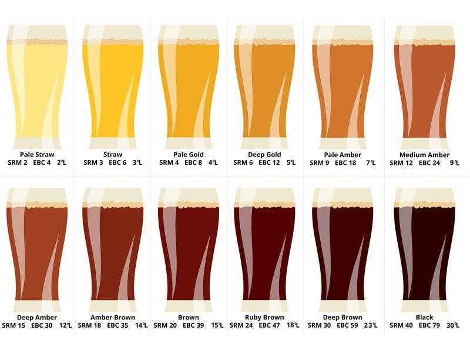

---
tags:
  - alko
---

# Пиво

[untappd](https://untappd.com/) - соцсеть про пиво, френдитесь [со мной](https://untappd.com/user/potykion)

## Какое бывает

- Светлое
    - Lager - просто светлое, хотя бывает и горчинкой
    - Pilsner - лагер с горчинкой
- Ale
    - Blond
    - IPA
- Пшеничное / Weiss
    - База - Paulaner
- Gose - пиво с солью
- Темное
    - Stout - темное пивко, вкус хлеба черного/кваса
    - Porter
- Smoothie - как понятно из названия - оч густое пиво, как смузи - не мой вар, потому что оч приторно
    - Бывают вообще дикие вещи, типа [Пиво с тортом Панчо](https://untappd.com/b/kulinar-pancho/5209954)
- Fruit / Sour - фруктовенько / кисленько
- Сидр - фруктовое певко, хороший
    - [Дальняя дача](https://dadasidr.ru/) - продается в перике и вв
- Медовуха / Mead / Melomel - приятный пивч с медовым вкусом
    - Хорошая - [Традиции Предков / mjolnir](https://mjolnir.pro/) - продается в вв
- Pastry - со вкусом сладостей

---

## Характеристики пива

- [Гид по характеристикам и показателям пива (ABV, IBU/EBU, OG, FG, SRM, EBC, BA)](https://beers.su/articles/gid-po-harakteristikam-i-pokazatelyam-piva-abv-ibu-ebu-og-fg-srm-ebc-ba)
- ABV - сколько градусов
- IBU - насколько горькое пиво

- OG - плотность, чем больше, тем _интереснее_ вкус
- SRM / EBC - цвет

## Где брать

- В сетевухах - напр. в ВкусВилле
- В пивных магазах - напр. в [Беру Выходной](https://beruvyhodnoy.ru/)
    - Чем хорош - на сайте можно посмотреть ассортимент: https://beruvyhodnoy.ru/stock/index.html
- Заказывать набор пив - напр. [PenaPack](https://pena.moscow/)

## Пивоварни

## Хорошие

- [Panzer Brewery](https://untappd.com/PanzerBrewery)
- [Salden's Brewery](https://untappd.com/Saldens)
- [ALASKA Brewery](https://untappd.com/AlaskaBreweryCo)

## С осторожностью

- Волковская Пивоварня

## Ссылочки

- [Пивные события](https://beers.su/events)
