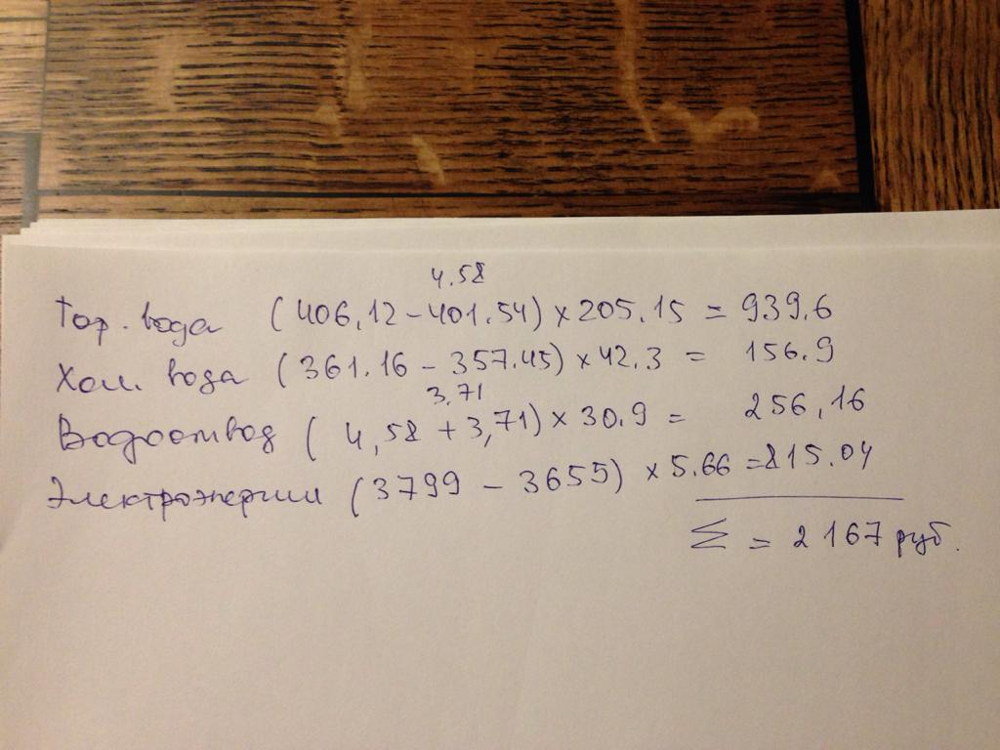

# Аренда квартиры

- Главное, что следует помнить об аренде квартиры, — она не твоя, тебя оттуда могут в любой момент выпизднуть

## Как снять?

- Смотреть нужно как можно раньше: чем дольше тянуть с просмотром, тем вероятнее хату снимут до тебя

### Где смотреть объявы?

- [Циан](https://www.cian.ru/) - лучший сервис по поиску хаты; пробовал и другие сервисы, но 4 раза снимал хату именно с
  ним
- [Авито](https://www.avito.ru/) - может быть больше хат, тк размещение не стоит денег
- [Яндекс.Недвижимость](https://realty.yandex.ru/) - стоит чекнуть ради [Яндекс.Аренда](https://arenda.yandex.ru/)

#### Че за Яндекс.Аренда?

- Нет залога и комиссии, но аренда чуть больше - в нее заложена комиссия Яндекс.Аренде
- Хат немного
- Все удаленно: **просмотр**, договор, получение ключей
- Посмотреть вживую можно, но это занимает дольше времени; хату могут забрать к тому времени
- Будет много звонков от менеджеров
- **Собственник может все отменить в последний момент(((**

### На что смотреть в объявах

- **Метраж**: 60м+; кухня тоже должна быть большой - 9м+
- **Прайс**: до 65к
- **Метро**: тверской район или d1
- **Техника**:
    - стиралка
    - плита - желательно 4 конфорки, можно 2, но придется докупить настольную плиту
    - духовка
    - опционально: посудомойка, кондик
- **Мебель**: диван, шкаф, кровать
    - Кровать: 200х200, не должно быть бортиков
- **Этаж**: не первый
- **Ванна**: ванна > душевая кабина; шторка > дверцы

### На что смотреть в хатах

- Все то же самое, что и в пункте выше, если фотки говно
- **Слышимость / звукоизоляция** - это хуй проверишь
    - Спросишь у агента/хозяина - они скажут, да все хорошо, а потом через пару недель слышишь как соседи пиздятся
      наверху (трустори)
    - Единственный способ - дом находится у дороги, а дорогу не слышно - вот это хороший знак
- **Розетки**: чем больше тем лучше
- **Вайфай**: обычно его нет или он хуевый - так что стоит спросить можно ли свой провести
- **Диван/кровать**: стоит потестить как на нем лежится - все-таки целый год на нем лежать

## Оформление и переезд

### Договор

- Бывают хаты от собственников, они не требуют договор, можно найти типовой и подписать для надежности
- Большинство хат - хаты с агентом: помимо формального оформление с договором и описью, нужно доплачивать комиссию
  агенту - обычно
  половина аренды

### Что надо для переезда

- Коробки
    - Коробки по 45л - это потолок, иначе становится страшно, что они развалятся
    - Цена за 20 коробок в 2022 ~ 1.5к
- Пупырки
    - Нужна в основном для посуды, стекла
    - 10м пупырки - это норм
    - Можно лутать в пунктах выдачи Озон, в магазах типа Hoff
- Маркеры - чтобы подписать коробочки; достаточно парочки
- Скотч - штуки 3-4 точно

### Сам переезд

- **Грузчики** - это мастхев!
    - Такой кайф, чилл когда пара грузчиков шустро загружают/разгружают тачку
    - Какой сервис использовать? - Яндекс
        - Привычный апп
        - Тачка приезжает за 5-10 минут
        - Можно до 2 грузчиков вызвать
        - Прайс 4-5к - за самую большую тачку и 2 грузчиков

## Житуха

### Коммуналка

- В идеале, просто фоткаешь счетчики, а лендлорд считает сколько ты должен

### Оплата

- Первое время лендлорд требует оплату налом и заглядывает в гости
- Затем может перестать заглядывать и принимает безнал переводом на карту
- Главное - ничего не писать в комментарии к платежке

### Проблемы

- О любых бытовых проблемах лучше всего сразу сообщать лендлорду
- Пример: в доме был джакузи, но его не тестили при оформлении, и оказалось, что он перестал робить, потому что им долго
  не пользовались
    - В итоге вызвали мастера - на все ушло в районе 20к - платил лендлорд