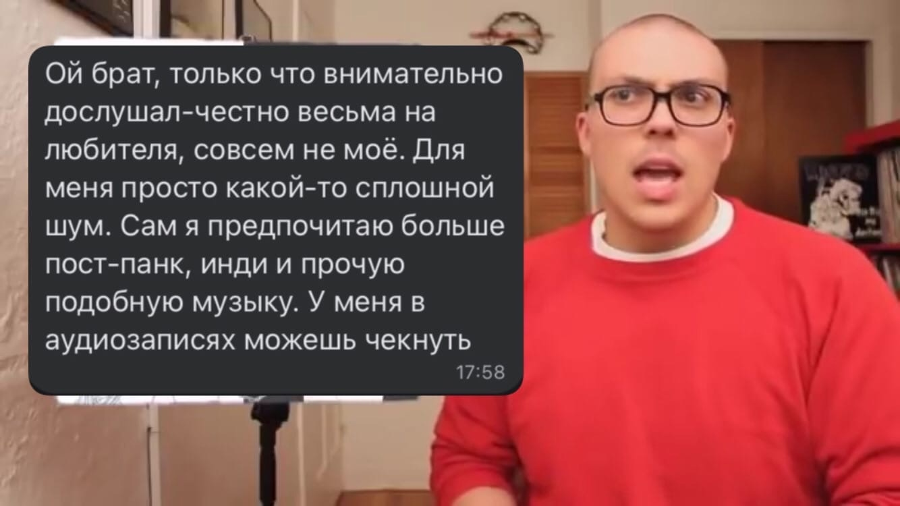

# Музыка

- Я очень люблю музыку, так, что она мне надоела
- Тем не менее, я хочу о ней написать
- Мой [плейлист с триповыми клипами](https://www.youtube.com/playlist?list=PLdb8DVmvU9i5bGINNz10f-ga_bqD41O4q)
- [Мемная База](https://vk.com/come_to_brazil)

---

## Музончик по жанрам

### Техно

Vitalic • Gesaffelstein • The Hacker • Locked Club • Any Act • Re:Drum • Schwefelgelb • MCR-T • DJ Gigola •
DJ MELL G • DJ Fuckoff • Boys Noize • X CLUB. • Partiboi69 • Jensen Interceptor • Asquith • Assembler Code •
Monolithic • baltra • Nørus • KETTAMA • DJ これからの緊急災害 (Wachita China)  • DM-90 • Dagga • Gusgus •
Skin On Skin • Dj Genderfluid • Schacke • Niki Istrefi • 박혜진 Park Hye Jin • LSDXOXO

### Экспериментальный реп

Death Grips • clipping. • JPEGMAFIA • Moodie Black • Dalek • Lil Darkie

### Хардкорчик / грайндкорчик

Nasum • Pig Destroyer • Nails • Xibalba • Varials • Jesus Piece • Rolo Tomassi • Full of Hell • No Zodiac • Rotten Sound • Gulch

### Sludge / Stoner / Doom

Conan • Godflesh • Weedeater • Bongzilla • The Body • Thou • Primitive Man • Bongripper • Fistula

### Панкуха / Рокешник

The Garden • Death from Above 1979 • Sleigh Bells  

### Escaperoom / Hyperpop / Experimental Electro

Sophie • Dorian Electra • Shygirl • Quay Dash • Chari XCX • ize • 100 gecs • Lil Mariko

### Drum'n'Bass / Jungle / Bassline 

Pendulum • Qemists • Concord Dawn • Noisia • Sewerslut • Lowriderz • Smoky D • General Levy • Rene LaVice

### Русский рэп

Kunteynir • уннв • d46l.o (дабл о) • Овсянкин • SLIVKO • Кровосток

### Грустный денс

benzii • Prince Innocence • Boy Harsher • Sassy 009 • George Clanton

### Мешапы

- Мешапы - это когда 2+ трека миксуют и получается прикольно
- Внезапно [музтв написал норм статью про это](https://muz-tv.ru/news/smeshano-i-smeshno-chto-takoe-meshap-i-pochemu-eto-tak-veselo/)
- Любимые мешаперы - ниже, обо всех них я узнал из [mashupble](https://vk.com/mashupble), соответственно, начать слушать
  их лучше с сетов с этого мероприятия

[Legaloli](https://vk.com/legaloli) • [sektorjazza](https://vk.com/cringerecords) •
[DeepSpaceAudio](https://vk.com/dspaudio) • [MOVIESTRAIFE](https://vk.com/moviestraife_group) •
[FinalSketch](https://vk.com/finalsketchmusic) • [Zetton](https://vk.com/zetton_mashups) •
[Качественный Саунд](https://vk.com/highqualitysound) • [Gefalsht](https://vk.com/gefalsht)

---

## Видасики про музыку

- [Roshi](https://www.youtube.com/MutenRoshi5137) - про экспериментальный репчик и электроникс
    - Стоит
      посмотреть: [про грипсов](https://www.youtube.com/watch?v=_oNJmLQpUTw)
- [Дзига](https://www.youtube.com/@dziga_main) - про индюшатину
    - Стоит
      посмотреть: [про марку де марку](https://www.youtube.com/watch?v=KKmCsAlKBZg)
- [spochkek](https://www.youtube.com/@spochkek) - еще про индюшатину
    - Стоит посмотреть: [про гарден](https://youtu.be/FRfQk89cKv4)
- [СКИЛЛЗ](https://www.youtube.com/@etoskillz) - про попс
    - Стоит
      посмотреть: [про искусство похуизма](https://www.youtube.com/watch?v=QO8detn9ZGs)
- [БРОКЕН ДЭНС](https://www.youtube.com/channel/UCWZ57aki9Xi0ZqhVBwZ87Pw) - про попс еще
    - Стоит посмотреть: [про salem](https://www.youtube.com/watch?v=huuGjMgcRWk)

