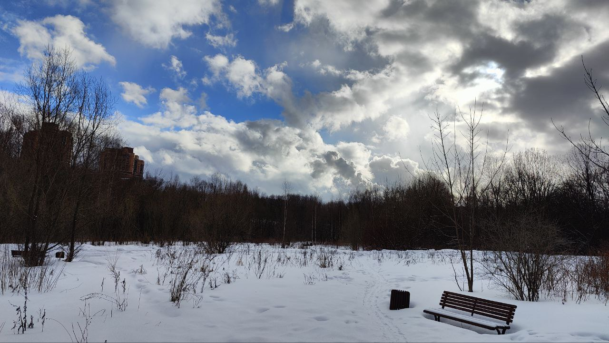
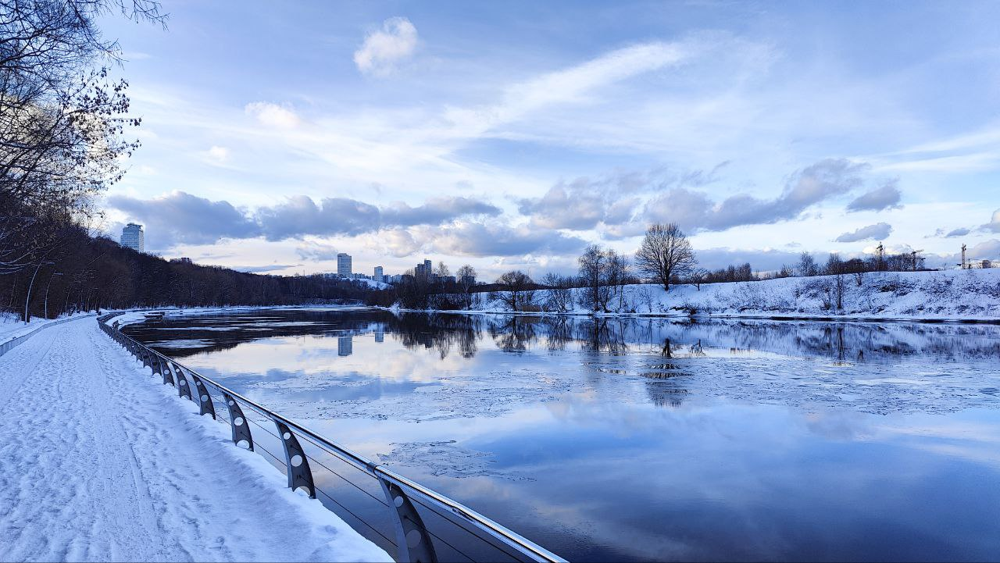
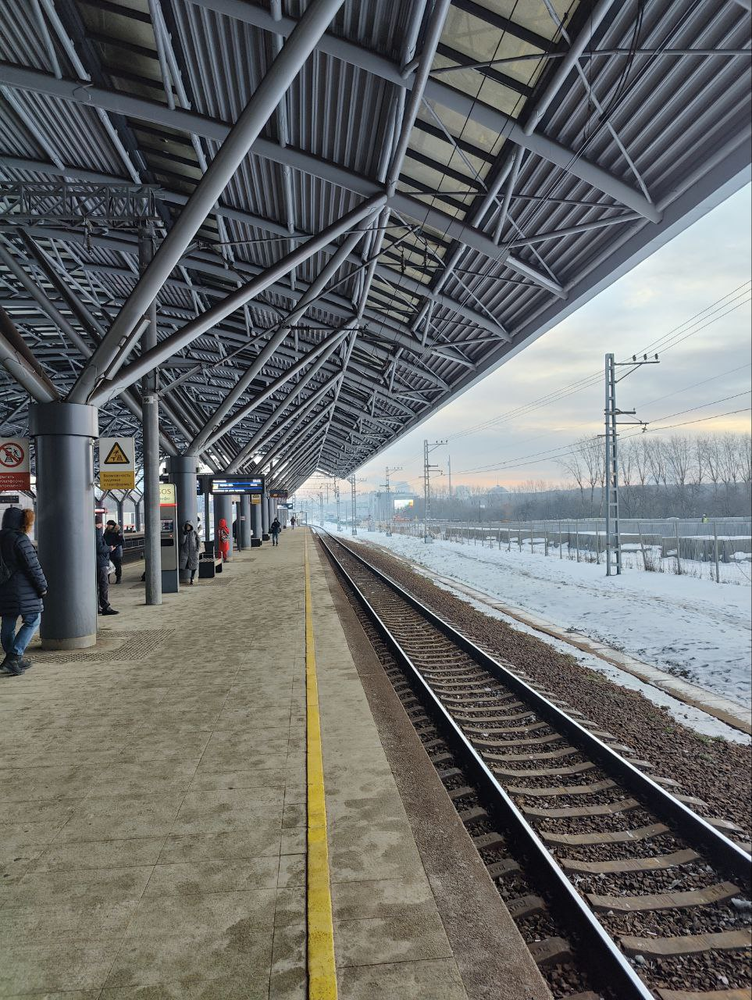
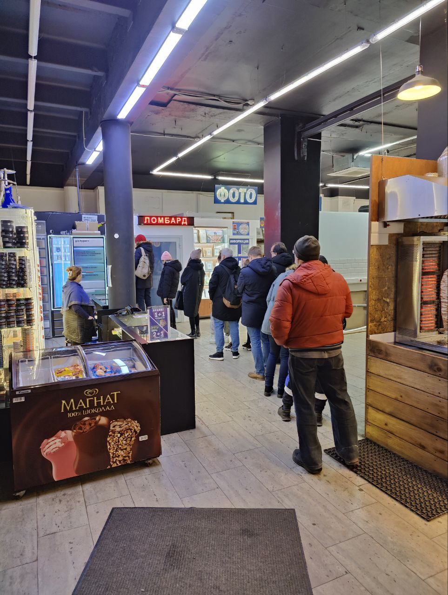

---
tags:
  - msk
---

# Славик ака Славянский Бульвар

## Чем хорош Славик?

- **2 парка**: Филевский и при реке Сетунь - гулять по ним балдеж

- **МЦД** - легко можно добраться до беговой, белора, савелы

- Хорошие пивные магазы, типа **Беру Выходной**
- **Куча ПВЗ**: 7 озонов, 10+ вб, 3 ям

<figure markdown  >

<figcaption>Но бывают и такие моменты...</figcaption>
</figure>

## Где есть?

- [**Сыроварня**](https://syrovarnya.com/) - норм рест с сыром: бурраты, дрочателлы в пиццунях, супах, брускетах (
  бутерах), пастах
- [**Опорный пункт**](https://yandex.ru/maps/-/CCUOf0T43C) - локальный бар, где есть норм еда, типа гречки с мясом
- Моремания - ну у нее много точек
- Да и все, конечно есть фастфуды стандартные, шава, но вообще **беда с жральнями** на Славике =/

### И как быть с едой?

- Ну, тут есть **много продуктовых магазов**: 3 перика (в тч пара больших), 2 магнита, 4 вв, 4 пятеры
- Мясные магазы, типа **Ассортиды** и ноунейм гастрономов
- Рыбные магазы, типа та же Моремания, Красная икра и ноунейм витрина в Ассортиде
- Так что закупаемся продуктами, и готовим, готовим, готовим

## Чем плох Славик?

- Как уже писал, негде есть
- Бомжи; попрошайки; музыкантишки, играющие цоя

---

## Итого 

норм для чиловой жизни