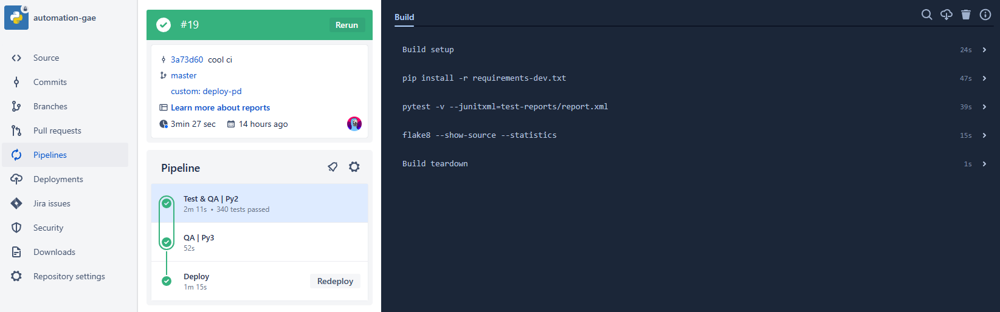
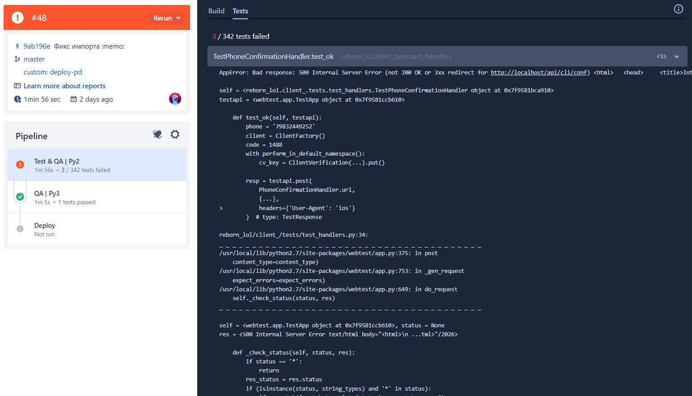
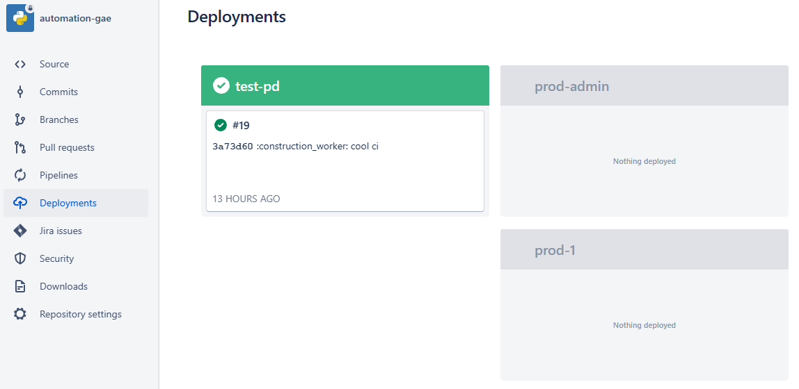

# BitBucket Pipelines

- [BitBucket Pipelines](https://bitbucket.org/product/features/pipelines) - CI/CD от BitBucket
- Простой - все в одном файлике



## Пример

- Все описывается в одном файлике - `bitbucket-pipelines.yml`
- Ниже - типичный пример пайплайна для Python-серва: тестим и линтим код, затем деплоим его в GCP:

```yaml
definitions:
  steps:
    - step: &test
        name: Test & QA | Py2
        image: python:2.7
        caches:
          - pip
        script:
          - pip install -r requirements-dev.txt
          - pytest -v --junitxml=test-reports/report.xml
          - flake8 --show-source --statistics
    - step: &qa
        name: QA | Py3
        image: python:3.9
        caches:
          - pip
        script:
          - pip install -r reqs3.txt
          - mypy
    - step: &deploy
        name: Deploy
        image: google/cloud-sdk
        deployment: test
        script:
          - gcloud auth login --cred-file=ci/sa.json
          - gcloud app deploy app.yaml

pipelines:
  default:
    - parallel:
        steps:
          - step: *test
          - step: *qa
  custom:
    deploy-test:
      - parallel:
          steps:
            - step: *test
            - step: *qa
      - step: *deploy

    deploy-prod:
      - parallel:
          steps:
            - step: *test
            - step: *qa
      - step:
          <<: *deploy
          deployment: prod
```

## Структура `bitbucket-pipelines.yml`

- [Документация по `bitbucket-pipelines.yml`](https://support.atlassian.com/bitbucket-cloud/docs/configure-bitbucket-pipelinesyml/)
- [Валидатор `bitbucket-pipelines.yml`](https://bitbucket-pipelines.atlassian.io/validator)

### `pipelines`

`pipelines` - джобы, которые будут запускаться при определенных триггерах

- `default` - то, что запускается при каждом коммите: тесты, линтинг, сборка
    - `step` - шаг джобы - запуск одной или нескольких комманд
    - `parallel` - запуск нескольких `step` паралелльно
- `custom` - то, что запускается руками - обычно деплой
    - `custom` - это объект, так что поля в нем именуются произвольно, напр. `deploy`
    - Значения объекта аналогичны `step` из `pipelines`

#### `step`

`step` - шаг джобы - запуск одной или нескольких комманд

- `name` - название
- `image` - Docker-image, в котором будут запускаться команды
- `caches` - кеш зависимостей
- `script` - список запускаемых команд

##### Репортинг

- При запуске тестов, можно выводить упавшие тесты
  в [раскрывающихся блоках](https://support.atlassian.com/bitbucket-cloud/docs/test-reporting-in-pipelines/):

    

- Для этого результаты тестов нужно выводить в JUnitXML формате:

    ```
    pytest --junitxml=test-reports/report.xml
    ```

- Можно использовать этот подход и для других тулов, поддерживающих JUnitXML, но напр. для mypy и flake8 смысла мало в
  этом - будет 1 блок со всеми ошибками

#### `deployment`

`deployment` - то что собрали и развернули на среду

- Можно просматривать в интерфейсе BB, смотреть какие коммиты развернуты, можно сделать откат
  
- В контексте `bitbucket-pipelines.yml` - это набор переменных:
  

### `definitions`

`definitions` - всякие переиспользуемые штуки, используемые в пайплайнах

- `steps` - переиспользуемые шаги или [YAML anchors](https://support.atlassian.com/bitbucket-cloud/docs/yaml-anchors/)
    - `step: &{name}` - каждый шаг помечается `&{name}`, а затем используется в `pipelines` с помощью `*{name}`
      или `<<: *{name}`
    - `*{name}` - для простого использования
    - `<<: *{name}` - для использования с переопределением переменных или деплоев

