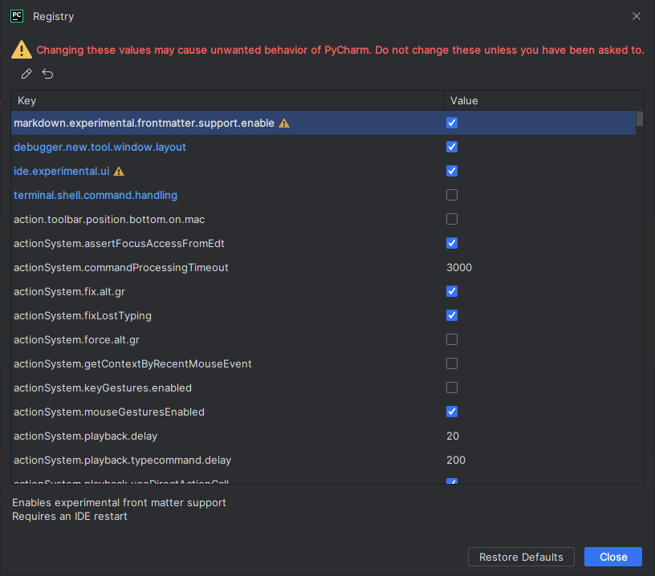

---
 tags:
   - py
---

# PyCharm

## Экспериментальные фичи и registry

- В PyCharm есть экспериментальные фичи, которые скрыты от глаз обычных юзеров
- Чтобы включить их, нужно залезть в Registry: `Ctrl + Shift + A > Registry`



- Так `markdown.experimental.frontmatter.support.enable` включает форматирование markdown-frontmatter - yml-метадату
  markdown

## Что делать если PyCharm рендерит html как Ðазвание?

Проставить кодировки в html:

```html

<html lang="en">
<head>
    <meta charset="UTF-8">
    ...
</head>
...
```

## Как запускать скрипты/команды не через терминал, а по кнопке?

- Можно создать `Run Configuration` для этого
- Так для `mkdocs serve` можно создать конфигурацию `Python > Module` написать там `mkdocs` и `serve` в аргументах

## Http-клиент

### Что это?

- Http-запросы можно писать в файлах `.http`
- PyCharm предоставляет возможность выполнять http-запросы

### Как парсануть токен из респонса и проставить его в енвы?

```http
> 
```

Код выше проставит в глобальные енвы токен из респонса

## Плагины

- Хочу научиться их делать...