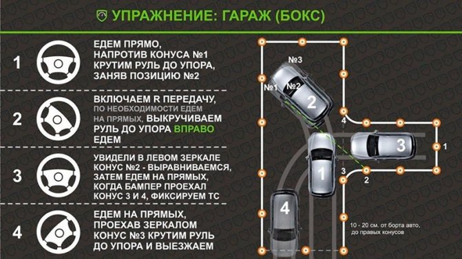

# Гараж

[Источник](https://autocheck.su/uchet-i-prava/kak-sdelat-parallelnuyu-parkovku-na-avtodrome-poshagovo.html)

1. Едем, пока не булет правого зеркала у конуса 4
    - Едем максимально прижавшись
2. Едем влево, пока не увидем конус 4 в правом зеркале
    - При повороте налево, Конус должен быть в 20 см от колеса - т.е. к началу зеркала
3. Едем назад, руль вправо, въезжая в гараж (бокс)
    - Сдаём назад, пока бампер не будет на линии конуса

## Видосы по теме

- <https://www.youtube.com/watch?v=LlcWT6IwTDc>
