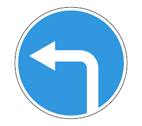
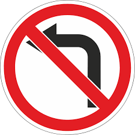
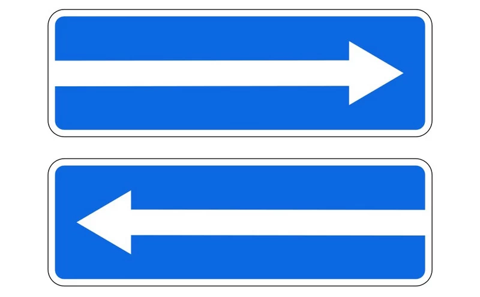
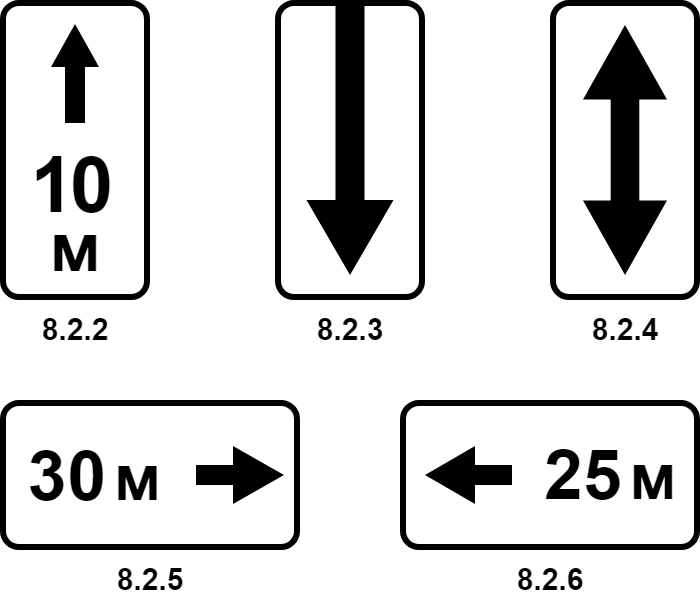
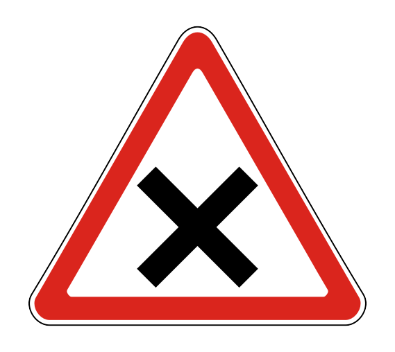
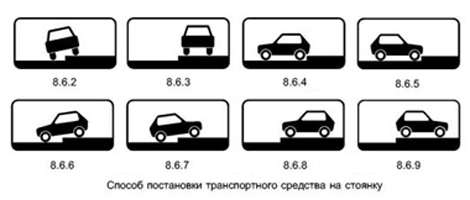

# Знаки

## Какие знаки робят только для грузовых?

- Направление движения для грузовых автомобилей
- Движение грузовых автомобилей запрещено
- Движение с прицепом запрещено

## Какие знаки разрешают разворот?

- Движение налево

- Движение налево запрещено

- Въезд на дорогу с односторонним движем

{ width="300" }

## Как работает знак "Зона действия"?

{ width="300" }

Показывает **протяженность** действия знака

## Как работает знак "Пересечение равнозначных дорог"?

{ width="200" }

Обгон возможен только до пересечения

## Когда можно развернуться при знаке "Движение прямо"

Развернуться (не провернуться) можно сразу после перика - знак действует до перика

## Действуют ли знаки на разрыве разделительной полосы?

Да

Важно не путать разрывы разделительной полосы с перекрестком

## Для кого работают знаки "Способ постановки тс"

{ width="200" }

- Первый для легковых авто, мотиков и грузовых до 3.5т

- Остальные - для легковых авто и мотиков

## Знаки руками

### Как показать остановку/уступку?

- Левая рука, поднятая вертикально (не в локте)

### Как показать поворот направо?

- Левая согнутая в локте
- Правая поднятая горизонтально

