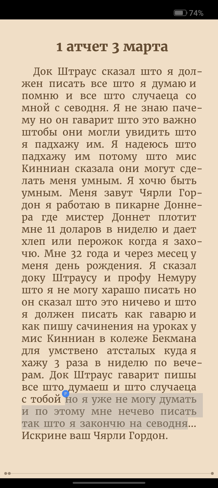

# Вкат в худ литру

Список легких для чтеня книг
https://mybook.ru/sets/1756-knigi-kotorye-chitayutsya-na-odnom-dyhanii/

Начал с Цветы для Элджернона

## Цветы для элджернона

- Книга начинается с текста, написанного с ошибками - класс
- Книга начинается с жизы

- Книга про отстающего в развитии чела, которому сделали операцию на моск, чтоб он поумнел

- Дропнул в итоге, потому что ему восстановили мозг и он начал вспоминать как его травили - скучно стало