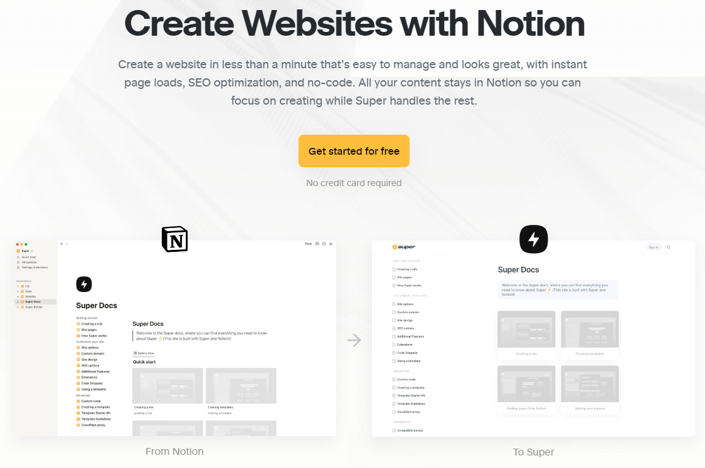
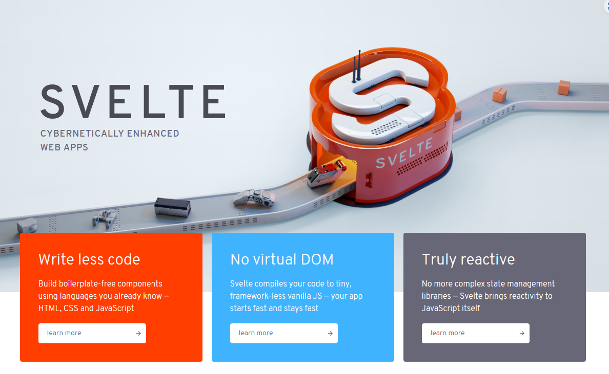
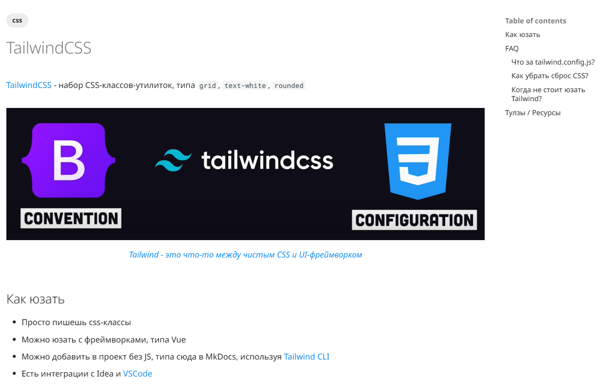

---
hide:
  - navigation
title: Выпуск 10 от 2023-03-13
---

# [📰](../index.md) выпуск 10

## 😮 Ого

10 выпуск этой шняги - рад, что не бросаю, не рад, что все это делается в пустоту

## ❓ Вопрос

Удивительно, но ЯМетрика говорит мне, что меня читают люди из Германии, Тайланда...

<div class="text-xl text-center"><b>ВЫ КТО БЛЯДЬ?</b></div> 

**_Напишите, плиз, о чем вам интересно читать_**

---

## 🔎 [super.so](https://super.so/) - сайтики на ноушене



## 🔎 [grid.is](https://grid.is/) - графички по данным из гугл-табл / ноушена


## 👷‍♂️ Вкат в Svelte и Go



- Ой, как приятно что в Свелт из коробки TypeScript - вообще ничо ставить дополнительно не надо, просто
  пишешь `lang="ts"` и погнали
    - И реактивность просто объявляя переменные, без всяких `ref`, `useState`: `let counter = 0; counter++`

- А Гошка - вообще нормальный типизированный язык
    - и форматтер из коробки
    - и сразу подчеркивает что не так
    - и inference есть
    - и типы можно именованые сделать: `type Id string`
        - и нет ебучего ооп, и нет эксепшенов - ой харош 💙💙💙

```go
func ListRecipesFromNotion() []Recipe {
  secret := notionapi.Token(NOTION_SECRET)
  client := notionapi.NewClient(secret)
  
  dbId := notionapi.DatabaseID(NOTION_DB)
  ctx := context.Background()
  pages, err := client.Database.Query(ctx, dbId, nil)
  if err != nil {
    return []Recipe{}
  }

  var recipes []Recipe
  for _, result := range pages.Results {
    recipes = append(
      recipes,
      Recipe{
        result.Properties["Name"].(*notionapi.TitleProperty).Title[0].PlainText,
      },
    )
  }

  return recipes
}
```

В общем, что Свелт, что Гошка пока хороши

## 🗻 С горочки катался

<video src="ride.mp4" controls></video>

## 🔎 Навалили фронтендов для Python

<iframe width="560" height="315" src="https://www.youtube.com/embed/HiNNe4Q32U4" title="YouTube video player" frameborder="0" allow="accelerometer; autoplay; clipboard-write; encrypted-media; gyroscope; picture-in-picture; web-share" allowfullscreen></iframe>

- [nicegui](https://nicegui.io/) - реактивный фронтенд для py
- [pyscript](https://pyscript.net/) - можно писать на py в html

## 📹 Наконецто новое видео от любимого обзорщика чая

<iframe width="560" height="315" src="https://www.youtube.com/embed/ugHjPhG8CJ8" title="YouTube video player" frameborder="0" allow="accelerometer; autoplay; clipboard-write; encrypted-media; gyroscope; picture-in-picture; web-share" allowfullscreen></iframe>

## [📝 Заметка про Tailwind](../../notes/tailwind.md)

