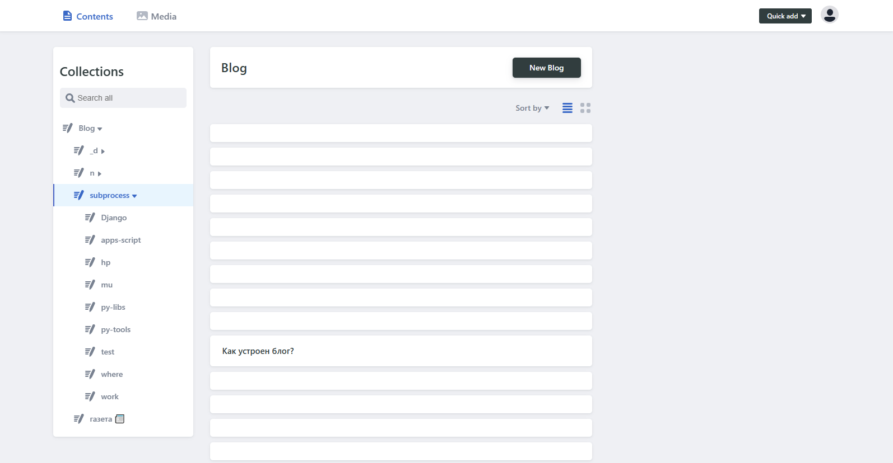
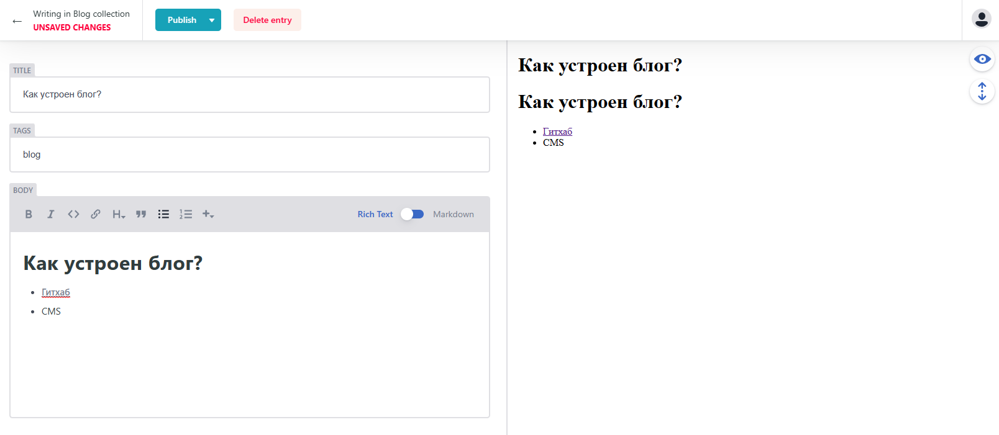
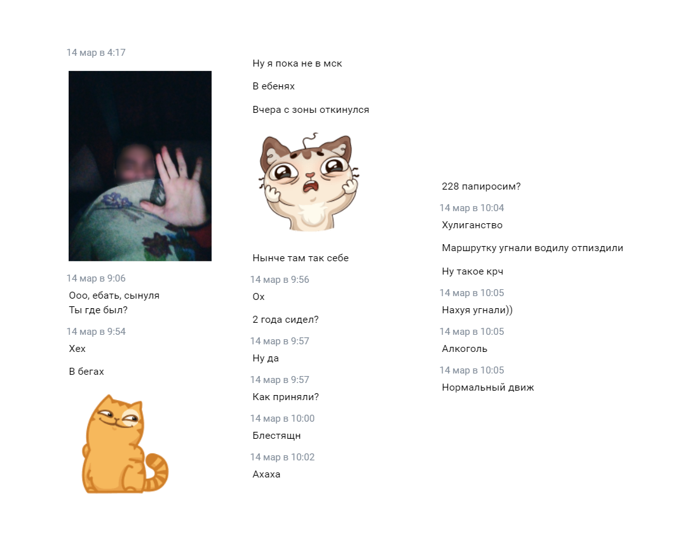

---
hide:
  - navigation
title: Выпуск 11 от 2023-03-20
---

# [📰](../index.md) / выпуск 11

## 👨‍💻 Чистка почты в одну строку

```javascript
function cleanGmail() {
  GmailApp.getUserLabelByName("label").getThreads().forEach(t => t.moveToTrash());
}
```

Спасибо [Apps Script](../../b/apps-script/index.md) за это


## 🎵 10000 gecs - новый альбум от гексов

<iframe width="560" height="315" src="https://www.youtube.com/embed/videoseries?list=PL259SQrrBF-Jv82X8XdKeFGZen3bLFtAo" title="YouTube video player" frameborder="0" allow="accelerometer; autoplay; clipboard-write; encrypted-media; gyroscope; picture-in-picture; web-share" allowfullscreen></iframe>

Все хорошо у ребят, написал [хороший отзыв](https://rateyourmusic.com/music-review/potykion/100-gecs/10_000-gecs-3/192923646)

## [📝 Написал про Славик](../../b/slavik.md)


## 😓 Markdown-CMSки - это боль

- [Tina CMS](https://tina.io/) - вообще не хочет парсить существующие `.md`-файлы, если в них html, или нет `title`
- [Decap CMS](https://decapcms.org/) (ex. Netlify CMS) - тоже ужасен
  - Из коробки [нет поддержки вложенных папок](https://github.com/decaporg/decap-cms/issues/4741) - это бета фича, которой уже 2 года
  - Спустя полтора часа гуглинга и трайхарда что-то получил:  

    
    
  - Получил сломанный интерфейс, которой не может в md-ссылки, а так же в адаптив 😓😓😓 

    

  - **Крч ниша Markdown-CMS свободна** - всем делать CMSки 

## [📝 Лучшие программулины для разрабов](../../b/best-dev-soft.md)

Небольшой списочек любимых тулзов

## 🎮 Прошел Postal Redux


Тупа Хотлайн, ток ттк большой, а так весело, а [саунд вообще крейзи](https://music.yandex.ru/album/12409799)

## 😎 Возвращение блудного сына

