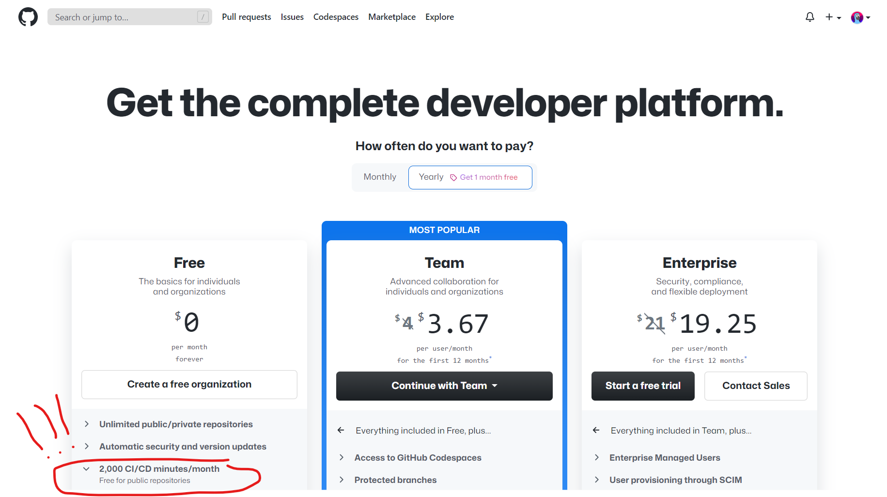
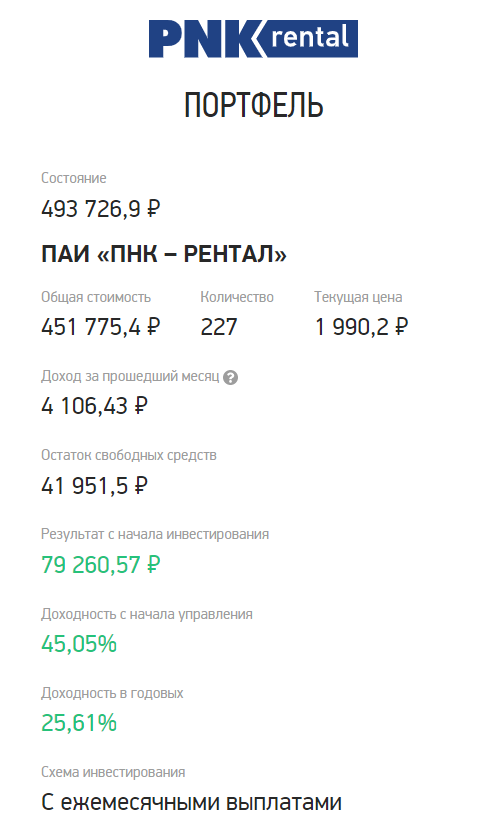
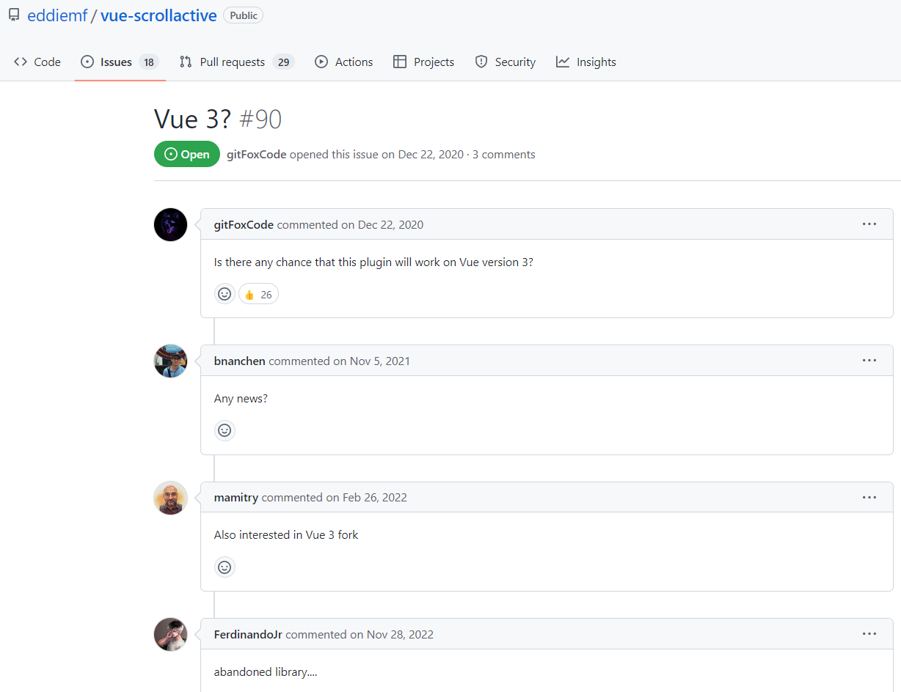

---
hide:
  - navigation
title: Выпуск 12 от 2023-03-27
---

# [🗞️](..) Выпуск 12 от 2023-03-27 

## 👀 Статус

Теперь буду писать сюда че я делаю/смотрю/слушаю/... в данный момент, а то забываю

На 2023-03-27 я:

- Смотрю [курс по гошке](https://www.youtube.com/playlist?list=PLrCZzMib1e9q-X5V9pTM6J0AemRWseM7I) (1 / 9)
- Пилю [приложуху с рецептами](https://github.com/potykion/skovoroda), ибо ноушн неудобен
- Пилю [приложуху с музыкой](https://github.com/potykion/player), ибо в яндексе туго с новиночками + старье могут
  выпилить

## 📝 Написал о [признаках bullshit-job](../../b/work/bad-job.md)

## 😮 GitHub Actions оказывается бесплатный для приват-реп

2000 минут в месяц - это дохрена

Для сравнения я на проде в бб pipelines 700 минут трачу в месяц, и мы еще за это платим...

А во фри-тире в бб знаете сколько минут? 50! В 20 раз меньше гх!

## 😮 Антифог - топ тема от запотевания очков

<figure>

</figure>

Тупа пшикаешь ее в очки для плавания и очки больше не потеют - так кайфанул ващеее

На них написано, что держут 12 часов - это конечно пиздеж, но на часок поплавать более-менее хватает

## 🤔 Еще заебал медленный HMR mkdocs

Mб пора на [HuGO](https://gohugo.io/) или [Astro](https://astro.build/)???

## 💰 [ПНК Рентал](https://pnkrental.ru/) - все

Очень жаль, было хорошо

<figure markdown>
  
</figure>

## 🧑‍💻 Потраил Vue3 на проде

Пока не все хорошо:

- Ssg на чистом вью3, даже с [vite-ssg](https://github.com/antfu/vite-ssg), сосёт, надо [нукст](https://nuxt.com/) 
- Не все либы переведены на вью3

  
<figure markdown>
  
  <figcaption>Типикал ишью про vue3 support</figcaption>
</figure>
  
- `ref.value` писать заебывает, особенно после Свелта

Что порадовало:

- [vue-debounce](https://github.com/dhershman1/vue-debounce) - чисто на текстовый инпут (даже кастомный, типа v-text-field из vuetify) вешаешь и кайф
- [vue-json-viewer](https://github.com/chenfengjw163/vue-json-viewer) -  симпотный джсон вьювер с вью3 саппорт, хотя большие джсонки тяжко рендерит

## 🔎 [Ботик, чтобы оплачивать онлайн покупки](https://t.me/for_pur_bot)

Он типа создает виртуальную одноразовую казахстанскую карту, на нее закидываешь бабос, и по ее реквизитам платишь

## 🔎 [Loop - Notion от Microsoft](https://www.microsoft.com/en-us/microsoft-loop)

<video src="https://cdn-dynmedia-1.microsoft.com/is/content/microsoftcorp/WhatisLoop_video_en-us-0x720-3266k" controls></video>

