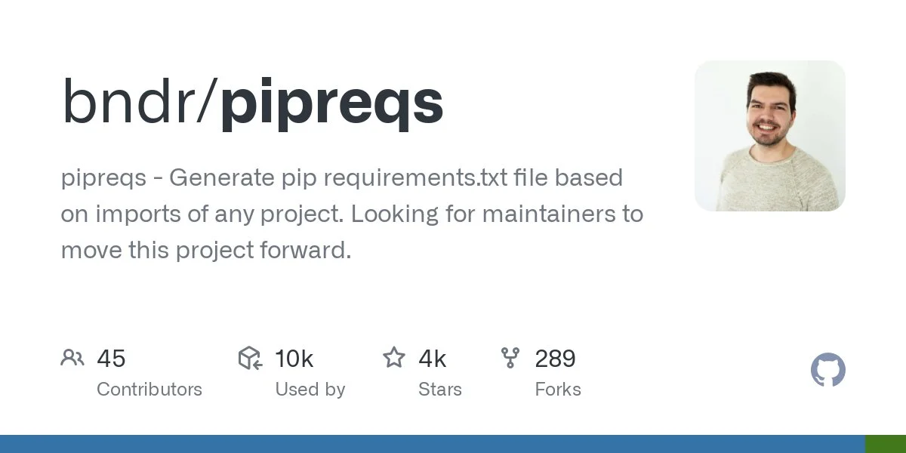
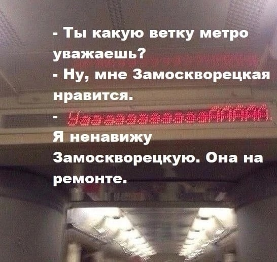
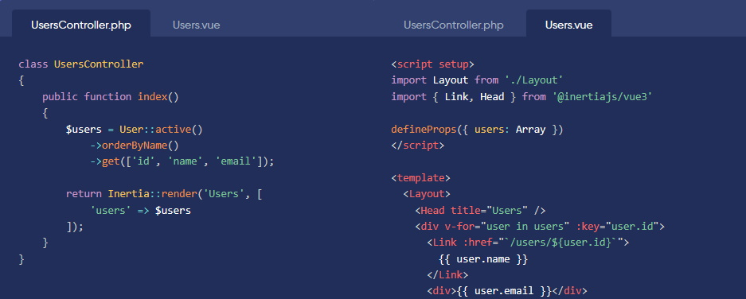
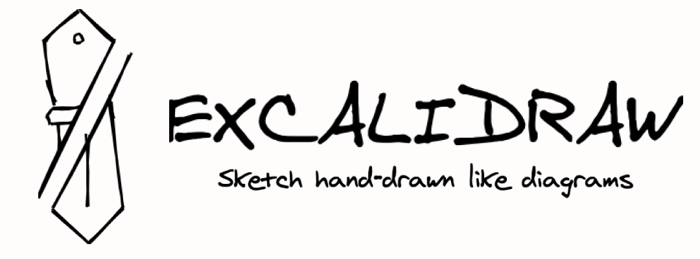

---
hide:
- toc
- navigation
title: Выпуск №2 от 2023-01-16
description: Новости моего манямирка
cover: g/2/cover.jpg
---

# [Газета 📰](../index.md) / Выпуск №2 от 2023-01-16 {.no-margin}

_Новости моего манямирка_

<a target="_blank" href="/c/ops/bb_ppl">

📝 <b>BitBucket Pipelines</b> - CI/CD от BitBucket, не сложнее GitHub Actions - все в одном файлике

</a>

<iframe frameborder="0" style="border:none;width:100%;height:180px;" width="100%" height="180" src="https://music.yandex.ru/iframe/#track/106295920/23151074">Слушайте <a href='https://music.yandex.ru/album/23151074/track/106295920'>Obsessed To Forget</a> — <a href='https://music.yandex.ru/artist/10012723'>benzii</a> на Яндекс Музыке</iframe>

🎵 <b>benzii</b> - тупа лучшая - мощный грустный денс

<a target="_blank" href="https://github.com/bndr/pipreqs">

🔎 <b>pipreqs</b> - идея прикольная: сканит код и выводит зависимости - удобно когда нет requirements.txt, или хочется стройный requirements, без сабзависимостей. 
Но работает только на Python 3+ 
<i>Жаль, что я утонул в Python 2 легаси, оч хочу перевести его на Python 3 в этом году, а то столько упускаю 😢😢😢</i>  

</a>

📷 <a href="https://youtu.be/XuBydGbCMLg" target="_blank">Уаааааа</a>

<iframe width="560" height="315" src="https://www.youtube.com/embed/erz0rCHp4jI" title="YouTube video player" frameborder="0" allow="accelerometer; autoplay; clipboard-write; encrypted-media; gyroscope; picture-in-picture; web-share" allowfullscreen></iframe>

📹 Итоги года от <b>Хулиномики</b>

<a href="../../c/py/tools/reloadium" target="_blank">

📝 <b>reloadium</b> - автоматический перезапуск PyCharm при правке кода во время дебага 
Но не без нюансов

</a>

<iframe width="560" height="315" src="https://www.youtube.com/embed/039le_PlshQ" title="YouTube video player" frameborder="0" allow="accelerometer; autoplay; clipboard-write; encrypted-media; gyroscope; picture-in-picture; web-share" allowfullscreen></iframe>

📹 <b>Arabian Psycho - The Perfect Girl</b> - ну это база

<iframe width="560" height="315" src="https://www.youtube.com/embed/ummPlTgajLo" title="YouTube video player" frameborder="0" allow="accelerometer; autoplay; clipboard-write; encrypted-media; gyroscope; picture-in-picture; web-share" allowfullscreen></iframe>

📹 Новы видик от <b>Хумака</b> - как всегда держит марку

<iframe width="560" height="315" src="https://www.youtube.com/embed/S7X6fLbdwlc" title="YouTube video player" frameborder="0" allow="accelerometer; autoplay; clipboard-write; encrypted-media; gyroscope; picture-in-picture; web-share" allowfullscreen></iframe>

📹 Как выбрать фронденд фреймворк в 2023 от реакт чела

📷 Мем недели - Шварц смотрит на Апофеоз войны

<a target="_blank" href="http://inertiajs.com/">

🔎 <b>inertia</b> - наконецто придумали клей для серва и фронта 
 Типа сходил на Python-серве в бд, отдал Vue-страничку сразу со стейтом 
 <i>Жаль пока только для PHP</i>

</a>

<a href="https://excalidraw.com/" target="_blank">

🔎 <b>excalidraw</b> - топ рисовалка диаграмм

</a>

<iframe width="560" height="315" src="https://www.youtube.com/embed/C2CNY8N5-iQ" title="YouTube video player" frameborder="0" allow="accelerometer; autoplay; clipboard-write; encrypted-media; gyroscope; picture-in-picture; web-share" allowfullscreen></iframe>

📹 Шахматы размером <b>269 байт</b> и другие извращения

<a href="https://fuckrkn1.org/#ru" target="_blank">

🔎 <b>FuckRKN1</b> - челы во главе @2pizza делают бесплатный впн

</a>

<iframe width="560" height="315" src="https://www.youtube.com/embed/d-yWg2AQdlc" title="YouTube video player" frameborder="0" allow="accelerometer; autoplay; clipboard-write; encrypted-media; gyroscope; picture-in-picture; web-share" allowfullscreen></iframe>

📹 Азеры делают мнооога <b>мандаринов</b> - тупа челы из учебника по математике

