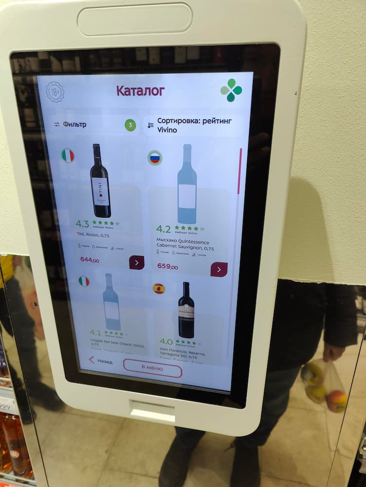
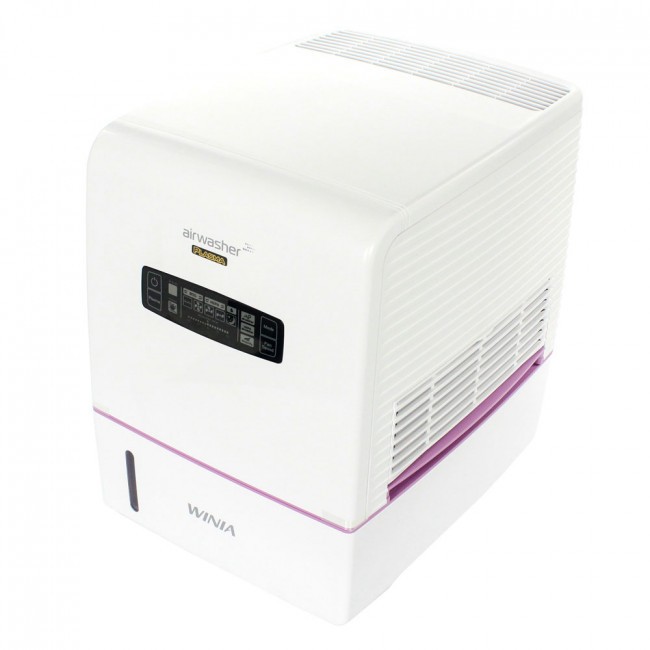
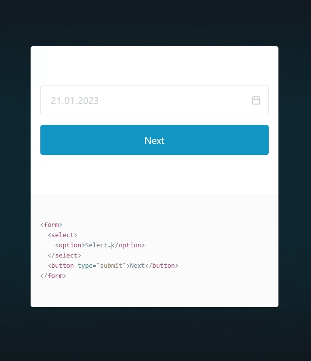
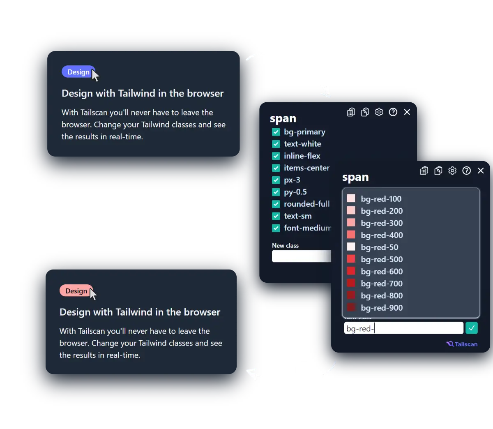
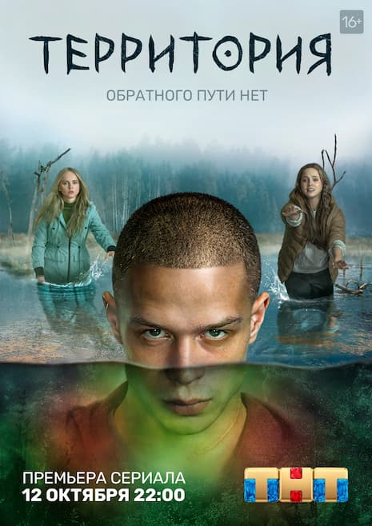

---
hide:
- toc
- navigation
title: Выпуск №3 от 2023-01-23
description: Новости моего манямирка
cover: g/3/cover.jpg

---

# [Газета 📰](../index.md) / Выпуск №3 от 2023-01-23 {.no-margin}

_Новости моего манямирка_

<a href="https://www.codux.com/" target="_blank">
<video muted  src="codux.mp4" autoplay></video>

🔎 <b>codux</b> - визуальная ideшка для Реакта, напоминает конструктор формочек в вижуал студии 🙃

</a>

📷 Думай позитивно

😮 Байда в Перике, которая <b>помогает выбрать винище</b>: куча фильтров и интеграция с Vivino

<a href="https://www.yegor256.com/2023/01/19/layout-of-tests.html" target="_blank">

📖 Про тесты от @yegor: именуй понятно, юзай фабрики, большие тестовые классы - это ок

</a>

<iframe width="560" height="315" src="https://www.youtube.com/embed/t9JIlFJbwmM" title="YouTube video player" frameborder="0" allow="accelerometer; autoplay; clipboard-write; encrypted-media; gyroscope; picture-in-picture; web-share" allowfullscreen></iframe>

📹 Как правильно пить? — Жрать лимоны 🍋

<a href="https://docs.hcaptcha.com/" target="_blank">
    
💡 Как бороться с абузом запросов?
    

    
    <b style="font-size: 2em; margin: 0 5px ">юзать капчу</b> 
    
    

    

</a>

<a href="https://winia.com.ua/ua/winia-awx-70ptwcd" target="_blank">

🔌 <b>Winia AWX-70</b> - топ мойка воздуха Больше не сушит дико по утрам, и глаза не жжет - кайф, всем микроклимат, пацаны

</a>

<a href="https://picocss.com//" target="_blank">

🔎 <b>pico</b> - css-либа без классов 

</a>

<a href="https://tailscan.com/" target="_blank">

🔎 <b>tailscan</b> - вот есть font-picker/color-picker, а это tailwind-css-picker - идея прикольная, но 
БЛЯДЬ 50 БАКСОВ ЗА ЭТО ТЫ ЧЕ 
tailwind этож просто набор цсс классов...

</a>

🎥 <b>Территория</b> - серик <i>на образах коми-пермяцкой мифологии</i>: пам, чуды, икотка - всратная славянская мистика

<iframe width="560" height="315" src="https://www.youtube.com/embed/zD6eXKvpehQ" title="YouTube video player" frameborder="0" allow="accelerometer; autoplay; clipboard-write; encrypted-media; gyroscope; picture-in-picture; web-share" allowfullscreen></iframe>

📹 Обзор Age of Wonders 1 - тупа навалил ИГРЫ ДЕТСТВА

