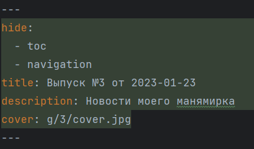
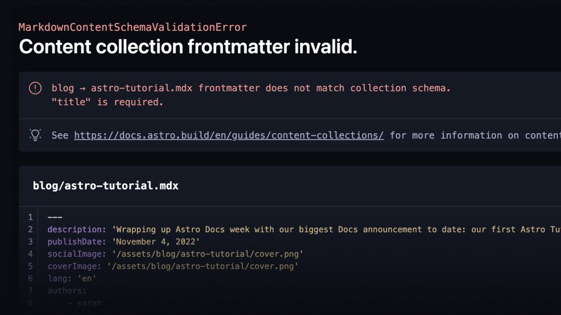
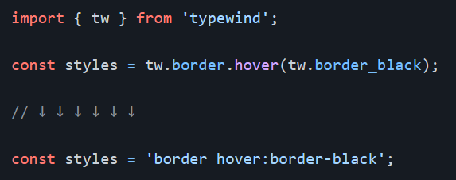
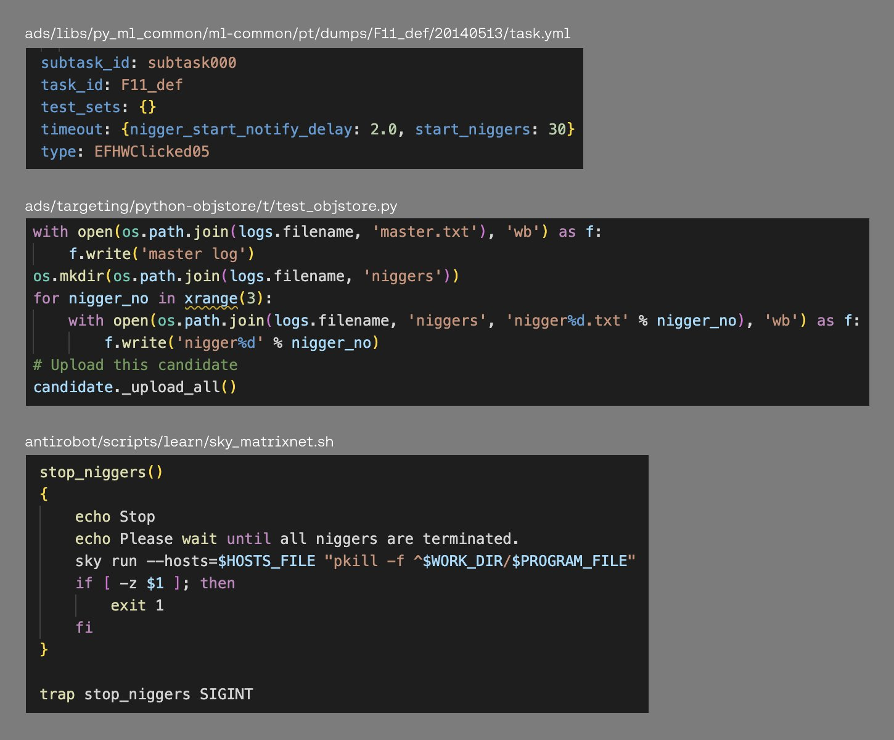
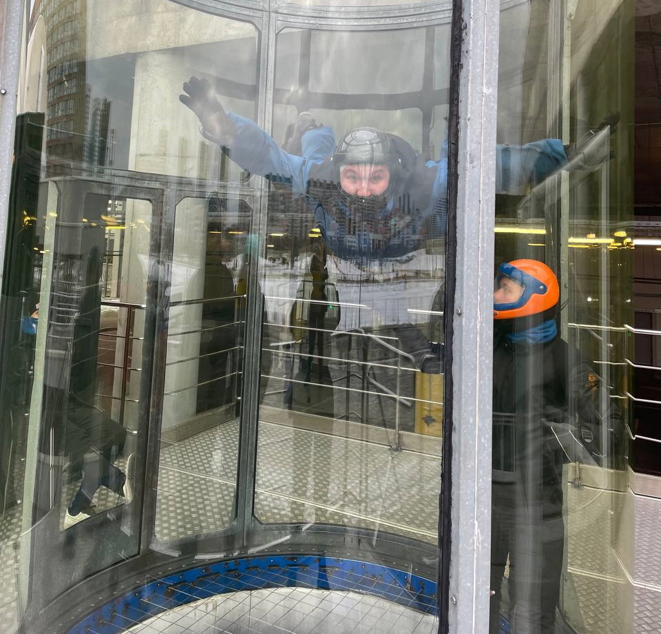

---
hide:
  - toc
  - navigation
title: Выпуск №4 от 2023-01-30
description: Новости моего манямирка
cover: g/4/cover.jpg
---

# [Газета 📰](../index.md) / Выпуск №4 от 2023-01-30 {.no-margin}

_Новости моего манямирка_

<b>😲 НАКОНЕЦТО FRONTMATTER-SUPPORT В PYCHARM</b> 
frontmatter (yml-метадата в markdown) больше не будет съеживаться при форматировании

<a href="/c/py/tools/PyCharm/">

📝 Чтобы включить frontmatter-support, надо залезть в <b>idea-registry</b> - разобрался как это сделать

</a>

<a href="/b/fun/mu/">

📝 Понял из чего должна состоять статья про музыку - <b>из музыки</b> 
Теперь там только исполнители, которых я слушаю

</a>

<a href="/b/fun/mu/tools">

📝 Скомпоновал кучу музыкальных тулз и осознал: 
если в ЯМузыке нет новых релизов, то можно их <b>спиратить и создать плейлист</b>, загрузив в него треки

</a>

📷 Мем месяца: Какой же он <b>ебучий</b>

<a href="https://github.com/stars/potykion/lists/python-ui" target="_blank">

🔎 Раньше ui на Python можно было писать только с помощью wxPython, а теперь можно и <b>транспайл во Flutter, и в React</b>

</a>

<a href="https://astro.build/blog/astro-2/" target="_blank">

🔎 <b>Astro v2</b> - завезли ебейшие рантайм ошибки, а не <code style=" background: #151924">Cannot read property of undefined</code> 

</a>

<a href="https://react.email/" target="_blank">

🔎 Верстать письма - это тот же гемор, говорят, <b>react-email</b> выручает

</a>

<a href="https://github.com/Mokshit06/typewind" target="_blank">

🔎 Приколюха: типизированный Tailwind CSS

</a>

<a href="https://twitter.com/bantg/status/1618794606518472706" target="_blank">

😂 Nill Kiggers в Яндексе

</a>

<a href="https://t.me/fa_sales_eu/2868" target="_blank">

😲 Купить SteamDeck в РФ

</a>

<a href="https://kodemo.com/" target="_blank">
<video src="kodemo.mp4" autoplay muted></video>

🔎 <b>kodemo</b> - тулза для создания интерактивной доки

</a>

<a href="https://icanfly.su/">

<b>🎉 Аэротруба</b> - прикольно, но после болит все тело - ощущение, что тебя ветер отпиздил

</a>

<iframe width="560" height="315" src="https://www.youtube.com/embed/wEOkMRCWPb4" title="YouTube video player" frameborder="0" allow="accelerometer; autoplay; clipboard-write; encrypted-media; gyroscope; picture-in-picture; web-share" allowfullscreen></iframe>

📹 Очень много <b>автоматов с едой</b>

<iframe frameborder="0" style="border:none;width:100%;height:180px;" width="100%" height="180" src="https://music.yandex.ru/iframe/#track/63544272/10120862">Слушайте <a href='https://music.yandex.ru/album/10120862/track/63544272'>Люблю я макароны</a> — <a href='https://music.yandex.ru/artist/1120270'>Эмиль Горовец</a> на Яндекс Музыке</iframe>

🎵 База от ЯМузыки

<a href="/c/ops/bb-ci/" target="_blank">

📝 Еще большее погружение в <b>BitBucket Pipelines</b>

</a>

