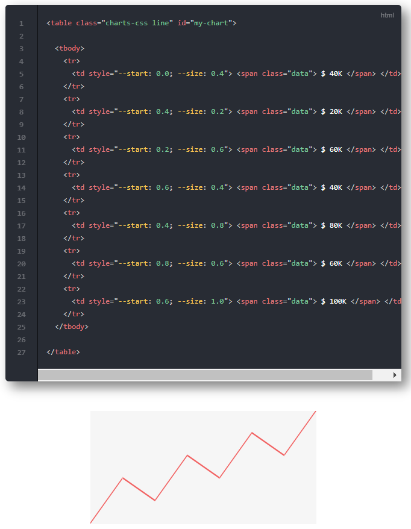
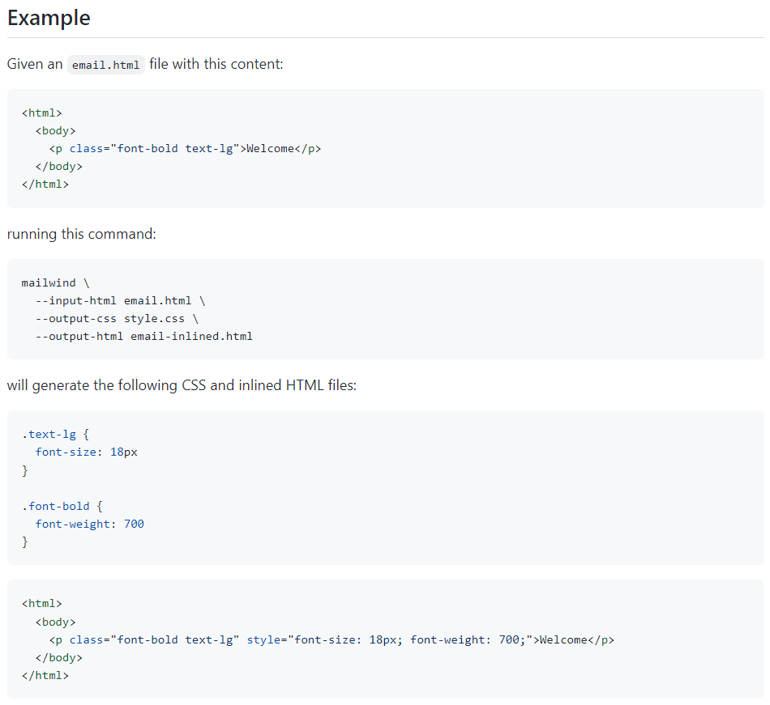
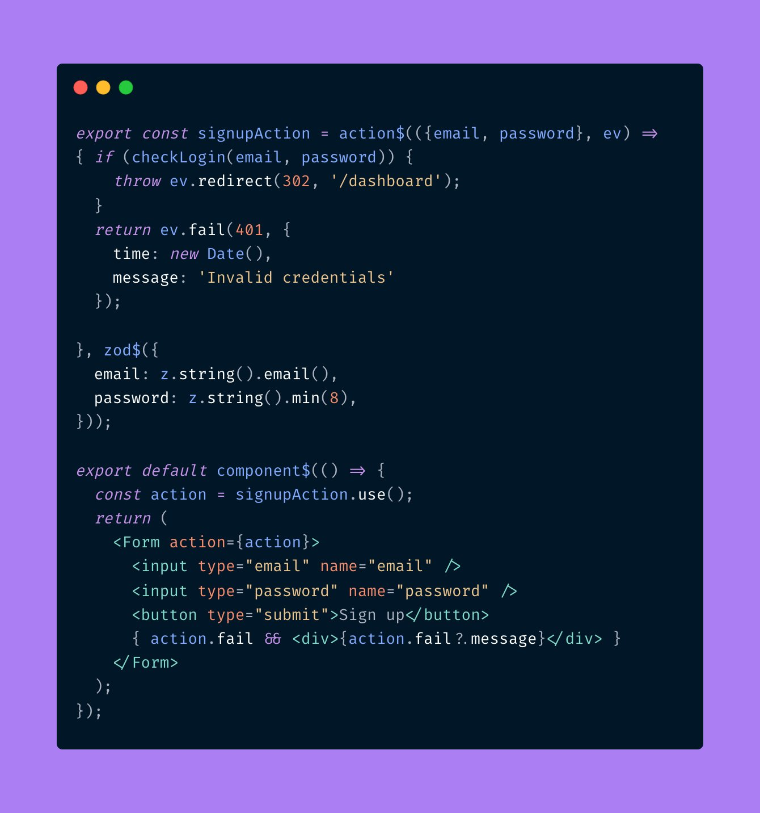
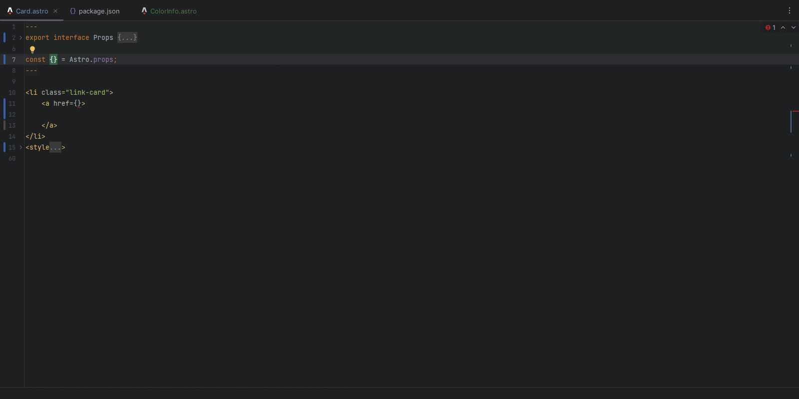
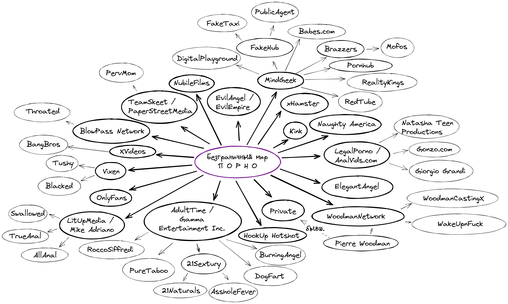
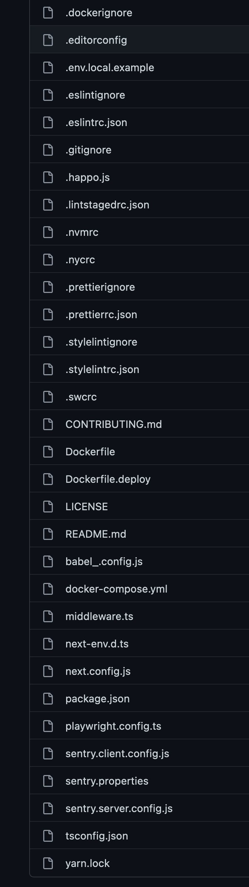
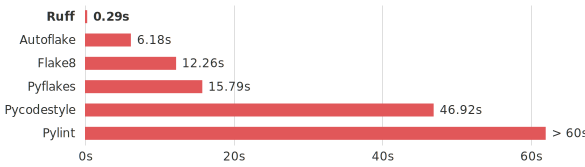

---
hide:
  - navigation
title: Выпуск №5 от 2023-02-06
description: Новости моего манямирка
cover: g/5/cover.jpg
---

# [Газета 📰](../index.md) / Выпуск №5 от 2023-02-06

## 🔎 [pdm](https://pdm.fming.dev/latest/) - аналог npm в python

- теперь **не надо ебать с virtualenv** и все само ставится как надо?
- Еще [hatch](https://hatch.pypa.io/latest/) туда же метит
- poetry напрягся крч

## 🔎 [браузер в консоли](https://github.com/fathyb/carbonyl)

<video src="browser.mp4" autoplay muted></video>

## 🔎 [Топ тулзов](https://stackshare.io/posts/top-developer-tools-2022#new) за 2022 от StackShareStackShare

1. Astro
1. SvelteKit
1. ChatGPT

## 🔎 [Графики на css без js](https://chartscss.org/)



## 🔎 [Письма на tailwind](https://github.com/soheilpro/mailwind) 



## 🔎 Next.js ебет: [типизированные ссылки](https://twitter.com/shuding_/status/1620137501192253440?t=ZGbAd5BOpARqVuxS2axVcA&s=19) и [типизированное сео](https://twitter.com/leeerob/status/1619743437577912321?t=R00oGwqimHZmmFMUqsZRXQ&s=19) из коробки 

<video src="nextjs.mp4" autoplay muted></video>

## 🔎 Ебет и Qwik: [типизированные формочки и интеграция с zod](https://twitter.com/manucorporat/status/1619746669452750848?t=TKVBEuuWq9ux6cSweQGFZA&s=19)



## 🔎 Еще [Astro support в WebStorm](https://blog.jetbrains.com/webstorm/2023/02/webstorm-2023-1-eap-3/)



## 🔎 Вообще неделя жёсткой ебли - [tailwind 4 с zero+config](https://twitter.com/adamwathan/status/1620261896611061760?s=20)

<blockquote class="twitter-tweet"><p lang="en" dir="ltr">Dream we&#39;re working towards for Tailwind CSS v4.0 — no `tailwind.config.js` file necessary, template paths are auto-detected, and your design tokens are configured in your CSS file.<br><br>(Syntax still very undecided, and all would be backwards compatible of course!) <a href="https://t.co/NwIaGnWVrX">pic.twitter.com/NwIaGnWVrX</a></p>&mdash; Adam Wathan (@adamwathan) <a href="https://twitter.com/adamwathan/status/1620261896611061760?ref_src=twsrc%5Etfw">January 31, 2023</a></blockquote> <script async src="https://platform.twitter.com/widgets.js" charset="utf-8"></script>

## 📝 Кстати о ебле: сделал картинку [**как все связано в порно**](../../notes/porn/index.md)



## 🤡 Modern js в одной [картинке](https://twitter.com/wesbos/status/1620793926306205701)



## 🤡 Приколюха: [сколько стоит созвон](https://twitter.com/0xgaut/status/1620815168921038850?s=20&t=sERV2B65dbiSlPKnD7wUqQ) и [кто на сколько опаздывает](https://twitter.com/theShaneLevine/status/1621515115777658881?s=20&t=sERV2B65dbiSlPKnD7wUqQ)

<div class="grid-2d" >
 
 
</div>

## 🔎 [dagger](https://dagger.io/) - CI на нормальных языках, который можно запускать на локалке

```python
import anyio
import dagger

async def main():
    async with dagger.Connection() as client:
        ctr = (
            client.container()
            .from_("alpine")
            .with_exec(["apk", "add", "curl"])
            .with_exec(["curl", "https://dagger.io"])
        )
        output = await ctr.stdout()
        print(output[:300])

anyio.run(main)
```

## 🔎 JetBrains готовит [чето для писательства](https://lp.jetbrains.com/-writerside-upd/)


## 🔎 [ruff](https://github.com/charliermarsh/ruff) - супер быстрый линтер для Python

