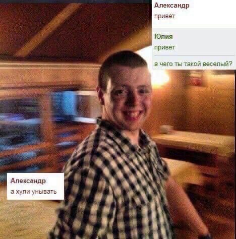

# Почему я спокойный?

Меня часто спрашивают "Почему ты такой спокойный" / "Как ты с нервяком справляешься"

Вот мои мысли по этому поводу:

- мне безразлично большое количество вещей - это с одной стороны печально, но зато спокойно жить помогает
- "а чё беспокоится?" - если повыяснять причины, то они обычно незначительны, и на них так же можно забить
- есть план на случай пиздеца
- борюсь со стрессом:
    - спорт - после трени беспокоится вообще нет сил
    - еда - когда вкусно, то не до грусти
    - сон - перезагружает тебя, становится проще
    - рутина - работать изо дня в день очень помогает, сидишь в потоке, и тебе не до всякого панического
    - секс - хорошо себя чувствуешь после него, опять же не до грусти
    - терапия - как вариант ходить к психологу, но это больше на долгосрок
    - развлечения - чисто поиграть в комп, отвлечься
    - алко - раз в месяц можно бухнуть по-приколы, ежедневно запивать стресс, конечно, не стоит
- анализирую свою текущую ситуацию: обычно, все заебись, ничего не меняется
- если какая-то хуйня происходит, то она рано или поздно закончится - нужно быть терпеливым
- избавляюсь от ненужного: отписываюсь от новостных пабликов, расстаюсь с раздражающими людьми 

