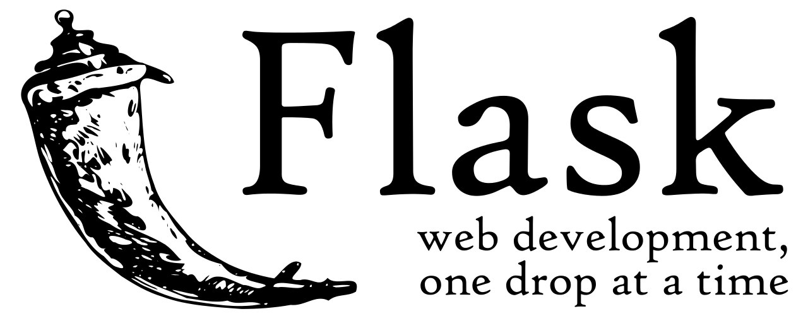
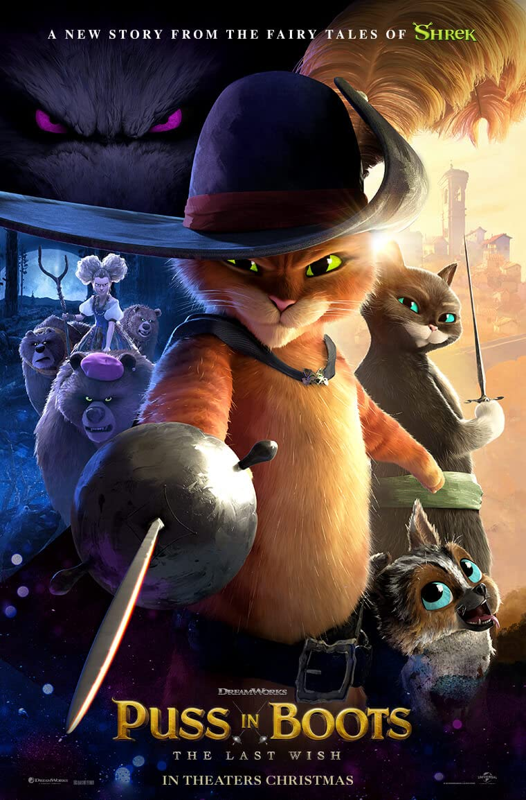
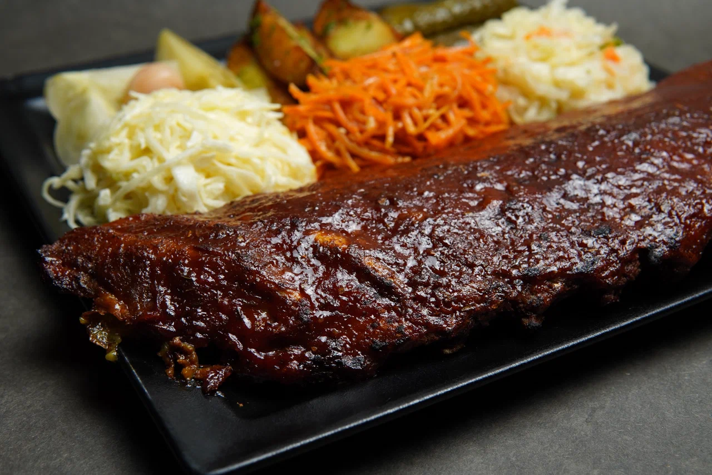

---
hide:
  - toc
  - navigation
title: '2023'
---

# 2023

<h2 class="font-bold"> Январь</h2>

<a class="card" href="/g">
    

    
    
<b>📝 Gazeta</b> 
    Теперь все мои находки в одном месте

</a>

<a class="card" href="https://www.alpacainfo.ru/">

<b>🦙 Альпаки</b> 
Прикольные зверушки, можно кормить, гладить

</a>

<a class="card" href="https://www.ozon.ru/category/winia-awx-70-sef/">

<b>🔌 Winia AWX-70</b> 
Вкатился в микро-климат, спится теперь хорошо

</a>

<iframe frameborder="0" style="border:none;width:100%;height:450px;" width="100%" height="450" src="https://music.yandex.ru/iframe/#playlist/leybovich-nikita/1087">Слушайте <a href='https://music.yandex.ru/users/leybovich-nikita/playlists/1087'>The Garden - Horseshit on Route 66</a> — <a href='https://music.yandex.ru/users/leybovich-nikita'>leybovich-nikita</a> на Яндекс Музыке</iframe>

🎵 Раз 10 переслушал, тупа нормальная панкуха

<a class="card" href="https://bitbucket.org/product/features/pipelines">

<b>👷‍♂️ BitBucket Pipelines</b> 
Тесты крутятся, деплои мутятся - CI в одном файле

</a>

## Февраль

👷‍♂️ 6 лет живем с легаси и никак не можем перейти с Py2 на Py3 - начинали переписывать все с нуля, а потом дропали. А переписывать с нуля ничо и не надо! - надо просто <b>инкрементально переводить легаси на Flask</b>, а потом и на Python 3 - и, на удивление, <b><i>результатов уже больше, чем за несколько лет неудачных попыток переписывания</i></b>

🚶‍♂️ Начал <b>гулять</b>: по парку походил, на уточек посмотрел, на пожранные бобрами деревья посмотрел 
<i><b>Гулять — лучшее занятие, чтобы почувствовать себя лучше</b></i>

<a class="rounded-xl shadow-md hover:scale-110 hover:border-blue-400 hover:border-4 bg-white lg:row-span-2" href="https://www.imdb.com/title/tt3915174/">

🎥 <b>Кот в Сапогах 2</b> — ахуенный мульт: рисовка класс, саунд-дизайн класс и Волк, который сыграл Смерть 💀

</a>

<iframe frameborder="0" style="border:none;width:100%;height:450px;" width="100%" height="450" src="https://music.yandex.ru/iframe/#album/23426419">Слушайте <a href='https://music.yandex.ru/album/23426419'>Хворь</a> — <a href='https://music.yandex.ru/artist/8106971'>Tsygun</a> на Яндекс Музыке</iframe>

🎵 Бодро, пацы ебошут хорошо

<a class="rounded-xl shadow-md hover:scale-110 hover:border-blue-400 hover:border-4 bg-white" href="https://restoranmyzhenaty.ru/">

😋 В <b>Питербрюхе</b> были, обжирались там - вот такие ребра заточили

</a>

- [Снекомания](https://potyk.notion.site/ce52fff3e97c453ba4dcfed11a714ad7?v=370a091b38cb402c889d4e27145873ab) 
- Вкат в [untappd](https://untappd.com/user/potykion)

## Март

- Пока, рис???