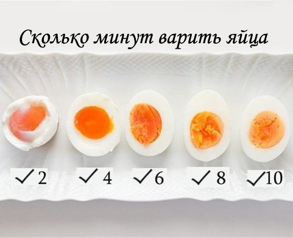

---
tags:
  - cook
---

# Как готовить базу?

## Рис

- [https://eda.ru/recepty/osnovnye-blyuda/rassypchatyy-ris-57517](https://eda.ru/recepty/osnovnye-blyuda/rassypchatyy-ris-57517)
- В кастрюлю засыпаем рис и воду в соотношении 1:1.5 - на 100г риса 150мл воды
- Доводим до кипения без крышки
- Накрываем крышкой, огонь на минималку, варим 10 минут
- Перемешиваем, оставляем отдыхать на произольное время
- 1 порция - 80-100г риса; **600г риса - это очень много**

## Нут

- Заливаем водой на ночь
- Затем в кастрюльку, заливаем водой, доводим до кипения, снижаем огонь, час варим

## Картоха

- Чистишь и кидаешь в воду, ставишь на огонь, дальше через минут 20 начинаешь чекать ножом мягкая ли картоха
- В мундире: все аналогично, только можно не чистить

## Яйки

- Аналогично картошке - сразу кидаешь в воду и начинаешь нагревать
- Когда вода закипит - засекаем время до какой степени хотим сделать яйца

### Яйца-Пашот

- Разбиваем яйцо в мисочку
- Венчиком делаем воронку: быстро-быстро мешаем воду и получаем воронку
- Выливаем яйцо и ждем пару минут
- Дуршлагом достаем яичко
- От яйца будут появляться "хлопья" - это нормально
