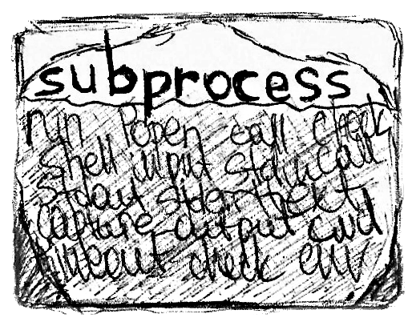

# `subprocess` { .no-margin }

_Запуск программ из Python в 1 строку_

<figure markdown>

<figcaption></figcaption>
</figure>

## TL:DR

Из 15 аргументов функции `subprocess.run`, позволяющей запускать программы из Python, по факту нужно 2-3 аргумента:

```python
subprocess.run('ping potyk.io', shell=True, capture_output=True, text=True)
```

---

## Что за `subprocess`?

`subprocess` - модуль для вызова консольных команд / программ из кода

## `subprocess.run`

`subprocess.run` - базовый метод для вызова команд:

```python
import subprocess

result = subprocess.run(['python', "-c", "print('ocean')"])
```

С этим методом все хорошо, кроме того что у него **15+ аргументов**

### Аргументы

#### Параметры вызова

- `args: List[str] | str` - команда, которую будем запускать, в виде списка аргументов или строки
    - Чтобы передавать команду в виде строки, нужно указать `shell=True`, но это
      считается [небезопасным](https://docs.python.org/3/library/subprocess.html#security-considerations)
    - Разбить команду на аргументы можно с помощью `shlex`:

        ```python
        import shlex
        shlex.split("/bin/prog -i data.txt -o \"more data.txt\"")
        ['/bin/prog', '-i', 'data.txt', '-o', 'more data.txt']
        ```
- `shell: bool = False` - если `True`, то можно было передавать команду в виде строки, но это
  считается [небезопасным](https://docs.python.org/3/library/subprocess.html#security-considerations)

#### Инпут

- `input: bytes = None` - байт-строка, которую нужно передать в команду; актуально, когда запускаемая команда требует
  ввести что-то, напр. пароль
- `stdin: subprocess.PIPE | file-like = None` - откуда брать инпут: из кода, из файла, из ниоткуда
    - Если указан `input`, то автоматически `subprocess.PIPE` проставляется

#### Аутпут

- `stdout: subprocess.PIPE | file-like = None` - куда выводить аутпут:
    - `subprocess.PIPE` - в stdout - т.е. в коде можно будет получить
    - `file-like` - в файл
    - `None | subprocess.DEVNULL` - никуда
- `stderr: subprocess.PIPE | subprocess.STDOUT | FileLike = None` - куда выводить ошибки:
    - `subpocess.PIPE` - в stderr - т.е. в коде можно будет получить
    - `subprocess.STDOUT` - в stdout
    - `file-like` - в файл
    - `None | subprocess.DEVNULL` - никуда
- `capture_output: bool = False` - если `True`, то про в `stdout` и `stderr` подставится `suprocess.PIPE` - т.е.
  перехватится аутпут вызова программы
- `text: bool = None, universal_newlines: bool = None` - вывод будет в виде строки, а не байтов

#### Прочее

- `cwd: str | Path = None` - меняет директорию перед запуском команды; хотя по ощущениям не оч робит, напр. в случае
  активации venv
- `timeout: int = None` - таймаут (в секундах): если вызываемая команда выполняется больше таймаута, то будет
  исключение `TimeoutExpired`
- `check: bool = False` - если `True`, то кинет исключение, если exit code != 0
- `env: dict = None` - переменные среды, которые будут выставлены на время запуска команды
- `encoding: str = None` - кодировочка (для ру-вывода пробуем `utf-8`, `cp866`, `cp1251`)
- `errors=None` - хрень какая-то

#### Итого

Итого, чаще всего `subprocess.run` запускаем так:

```python
subprocess.run(
    "...",
    shell=True,
    capture_output=True,
    text=True,
)
```

### Что возвращается?

- `subprocess.run(...) -> subprocess.CompletedProcess`
- `CompletedProcess.returncode -> int` - exit-code вызова команды
- `CompletedProcess.stdout -> str | bytes, CompletedProcess.stderr -> str | bytes` - вывод команды

## Как читать вывод построчно?

- `subprocess.run` запускает команду и **ждет** ее завершения, т.е. вызов **блокирующий**
- Иногда хочется запускать команду и читать ее аутпут постепенно, напр. при запуске тестов
- Для такого кейса используем `subprocess.Popen`:

```python
proc = subprocess.Popen(...)
```

- Аргументы `subprocess.Popen` аналогичны `subprocess.run`
- У созданного инстанца есть ряд методов:
    - `Popen.communicate() -> Tuple[bytes, bytes] | Tuple[str, str]` - ждет завершения команды и отдает stdout и strerr
    - `Popen.wait()` - ждет завершения команды и ничо не возвращает
    - `Popen.stdout -> file-like` - stdout в виде file-like <- это нам пригодится далее для кейса последовательного
      чтения аутпута
    - `Popen.poll() -> int | None` - вернет exit-code, если закончилось выполнение команды, `None` иначе

Итак, как нам читать вывод построчно?

`Popen.stdout` возвращает `file-like`, а его мы, как раз, можем читать построчно:

```python
proc = subprocess.Popen(...)
while True:
    line = proc.stdout.readline()
    ...
    if proc.poll() is not None:
        break
```

## Ссылочки

- https://docs.python.org/3/library/subprocess.html - дока по subprocess
- https://janakiev.com/blog/python-shell-commands/ - с этой статьи я начал
- https://www.digitalocean.com/community/tutorials/how-to-use-subprocess-to-run-external-programs-in-python-3 - довольно
  кратенько про subprocess
- https://stackoverflow.com/questions/13332268/how-to-use-subprocess-command-with-pipes - это и ниже - частые вопросы на
  стеке про subprocess
- https://stackoverflow.com/questions/4760215/running-shell-command-and-capturing-the-output
- https://stackoverflow.com/questions/2804543/read-subprocess-stdout-line-by-line
- https://realpython.com/python-subprocess/ - оч много букаф
