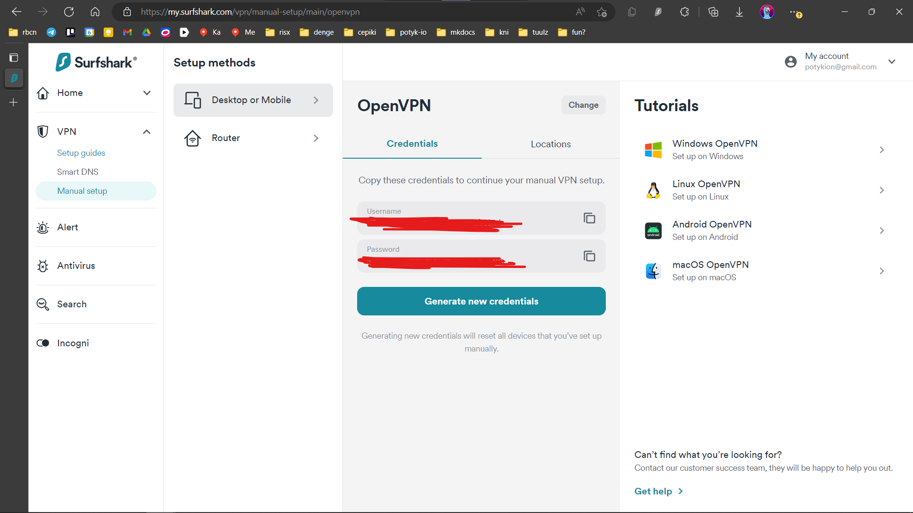
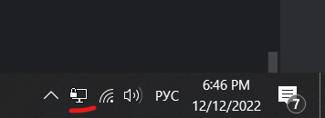
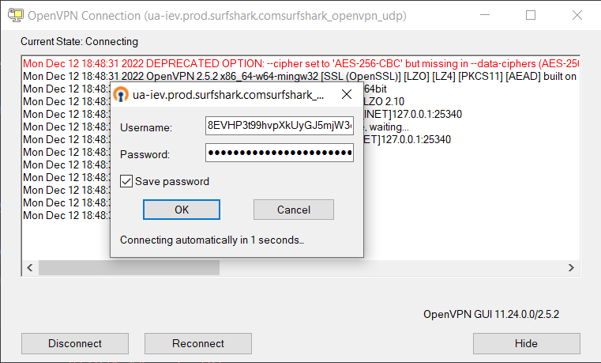
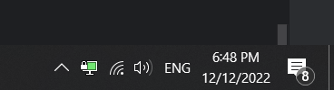

---
 tags:
   - services
---

# VPN

## Surfshark

- [Surfshark](https://surfshark.com/) - нормальный платный VPN
- Прайс - 3.6к (€60) за 2 года на скидосах ([реферал очка](https://surfshark.club/friend/VCC4DRsx))
- Есть клиенты под все платформы (иос, ведроид, линух, шиндовс, веб, мак)

### Блокировка Surfshark в России - как обойти на Windows?

- 11 декабря 2022 [Surfshark перестал работать в России](https://habr.com/ru/news/t/704810/)
- Но блокировку можно обойти,
  следуя [гайду](https://support.surfshark.com/hc/en-us/articles/360010272839-How-to-connect-to-Surfshark-in-countries-with-internet-restrictions-on-Windows-)
- Здесь переведу этот гайд

#### Итак

- Идем в [лк](https://my.surfshark.com/home/dashboard) >
  VPN > [Manual Setup](https://my.surfshark.com/vpn/manual-setup/main)
- Выбираем OpenVPN - видим такое:

  

- Выписываем себе куда-нибудь Username и Password - пригодится дальше
- Меняем вкладку - Locations - выбираем понравившуюся страну, скачиваем UDP - получаем файлик, типа `al-tia.prod.surfshark.comsurfshark_openvpn_udp` 

  

- Теперь качаем [OpenVPN GUI](https://swupdate.openvpn.org/community/releases/OpenVPN-2.5.2-I601-amd64.msi) (ссылка взята [отсюда](https://support.surfshark.com/hc/en-us/articles/360003204233-How-to-set-up-OpenVPN-on-Windows#h_01ECA8MKVQHPYE4J6S45EHES31))
- Ставим OpenVPN GUI, нажимая Yes/I Agree/Next
- Запускаем OpenVPN GUI, видим появилась иконочка

  

- Жмем на нее, выбираем `Import File...`, и импортим файл, который получили ранее
- Теперь жмем `Connect` и вводим логин и пароль, также полученный ранее 

  

- Ввели, чутка ждем, появляется зеленая иконка и УРА SURFSHARK СНОВА РАБОТАЕТ!

  

#### Гайды на другие платформы

- В целом, все аналогично: так же ставим openvpn, так же качаем файлы из серфшарка
- [ios](https://surfshark.com/ru/blog/connect-to-vpn-from-countries-with-restrictions-ios)
- [android](https://surfshark.com/ru/blog/connect-to-vpn-from-countries-with-restrictions-android)
- [windows](https://surfshark.com/ru/blog/connect-to-vpn-from-countries-with-restrictions-windows)
- [macos](https://surfshark.com/ru/blog/connect-to-vpn-from-countries-with-restrictions-macos)
- [linux](https://surfshark.com/ru/blog/connect-to-vpn-from-countries-with-restrictions-linux)

## Еще варики

- [FuckRKN1](https://fuckrkn1.org/) - "_Делаем некомерческий VPN, не собирающий никаких данных._"
