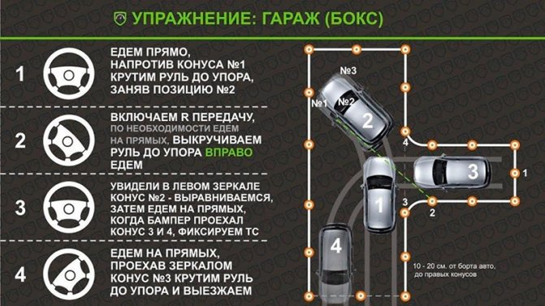

# Гараж

[Источник](https://autocheck.su/uchet-i-prava/kak-sdelat-parallelnuyu-parkovku-na-avtodrome-poshagovo.html)

1. Едем, пока не булет правого зеркала у конуса 4
2. Едем влево, пока не увидем конус 4 в правом зеркале
3. Едем назад, руль вправо, въезжая в гараж (бокс)

## Видосы по теме

- https://www.youtube.com/watch?v=LlcWT6IwTDc