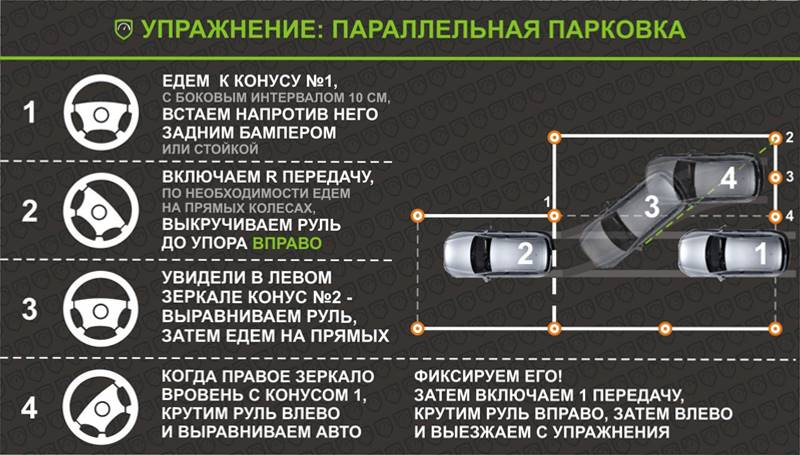

# Параллельная парковка

## Как делать?

[Источник](https://remont-avto.info/parallelnaya-parkovka-zadnim-xodom-poshagovaya-instrukciya/)

1. Заезд + сдать назад по-необходимости
2. Сдать назад, руль вправо
3. Сдать назад, руль прямо
4. Сдать назад, руль влево

### 1. Заезд + сдать назад по-необходимости

- Заезжаем, прижимаясь к правой стороне
- Сдаем назад до конуса 1 - палим это в заднее зеркало

### 2. Сдать назад, руль вправо

- Поворачиваем до тех пор, пока в левом зеркале не будет конус 2

### 3. Сдать назад, руль прямо

- Руль прямо - 1.5 - 2 оборота влево
- Двигаемся, пока колесо не наедет к линии между конусами 1 и 4 - палим это по левому зеркалу, опустив его вниз

### 4. Сдать назад, руль влево

- Поворачиваем налево до упора
- Заезжаем, пока в боковых зеркалах не будут видны конусы 2 и 4

## Видосы по теме

- https://www.youtube.com/watch?v=p3NaGVT9ZyM
- https://www.youtube.com/watch?v=MnX-B3WcMV0
- https://www.youtube.com/watch?v=LcLw_78Vuo8
